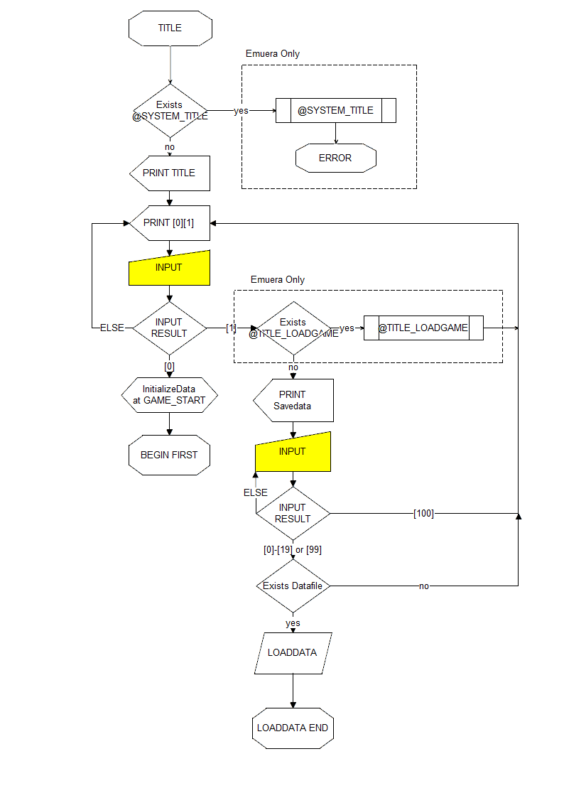
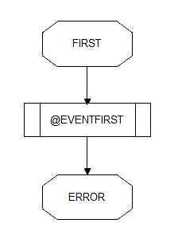
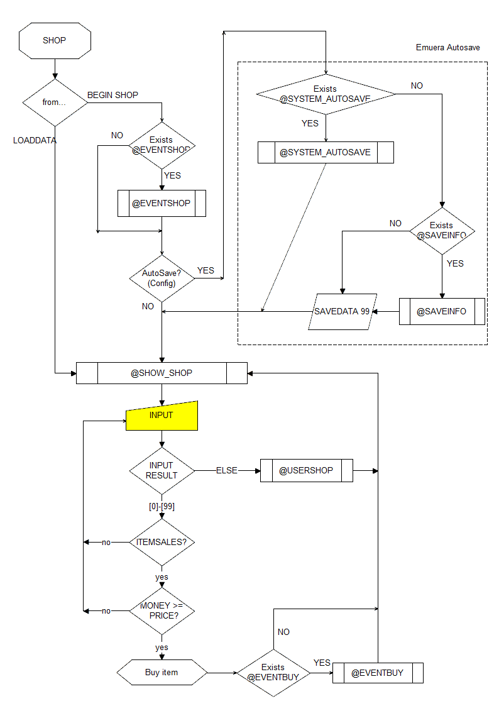
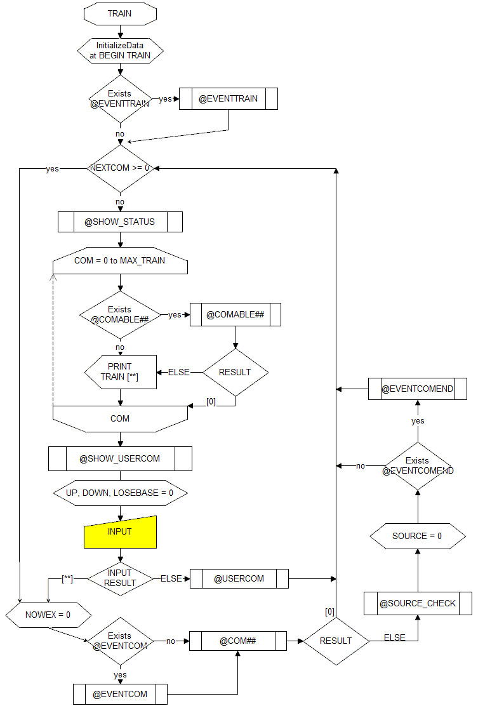
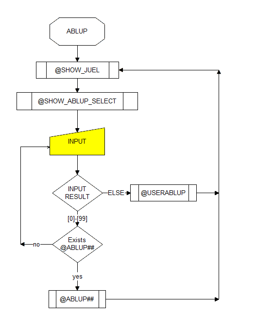
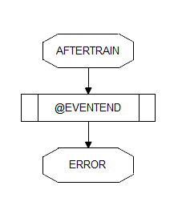
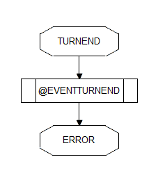
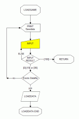
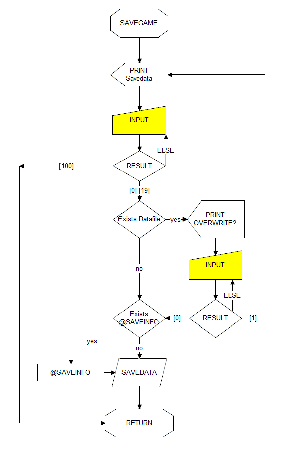
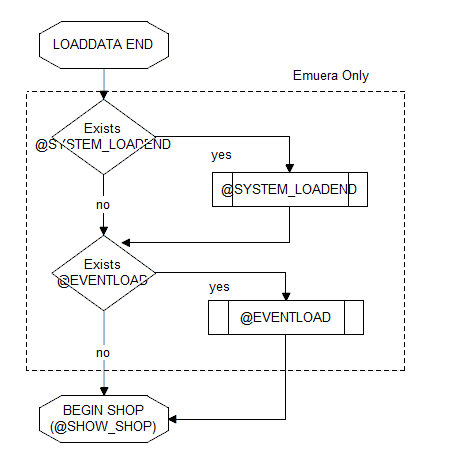

# Flowchart  
## TITLE  
After starting up and reading the ERB, and after running BEGIN TITLE.  

  

If @SYSTEM_TITLE is defined, call it and do nothing else.  
If BEGIN or LOADDATA instruction is not executed in @SYSTEM_TITLE and RETURN is executed, the next process is not executed; it ends in an error.  

If @SYSTEM_TITLE is not defined, the standard title processing is done.  
Characters such as "![0] Start from the beginning" on the standard title screen can be changed.  
See _replace.csv for details.  

If "![0] Start from the beginning" is selected, the first step is to initialize the data.  
More specifically, the initial values of STR and PRINTLV (the same as the RESETDATA instruction), ADDCHARA 0, etc.  
Next, BEGIN FIRST is executed to transition to FIRST.  

If @TITLE_LOADGAME is defined, it is called when "![1] Load and start" is selected.  
If not defined, the standard load screen is displayed.  
It is slightly different from the screen called from LOADGAME.  

## FIRST  
When "![0] Start from the beginning" is selected in the title screen and after BEGIN FIRST is executed.  
If the BEGIN instruction is not executed in @EVENTFIRST, the next process is not executed; it ends in an error.  

  

## SHOP  
After loading and running the BEGIN SHOP.  
If it is loaded, @EVENTSHOP is not processed.  

  

Request input after the @SHOW_SHOP call.  
If a value between 0 and 99 is received, the purchase process is performed, and if any other value is entered, @USERSHOP is called.  
This range can be changed by _replace.csv. See [replace _replace.csv] for more information.  
The range of items displayed by the PRINT_ITEMSHOP instruction is limited to the number of ITEMNAME or ITEMSALES elements, whichever is smaller (the standard is 1000).  

When the purchase process is called, it judges whether the corresponding ITEMSALES is non-zero or whether MONEY is greater than ITEMPRICE.  
If the purchase decision fails, it is requested to enter it again.  
In eramaker, if the purchase failed, It would start over from @SHOW_SHOP.  

If the purchase decision is successful, assign the ITEM number to the BOUGHT variable, increase ITEM:BOUGHT by 1, and reduce MONEY by ITEMPRICE:BOUGHT.  
Call @EVENTBUY and return to @SHOW_SHOP.  

Unless a BEGIN instruction is issued somewhere, it will never leave the SHOP.  

## TRAIN  
After BEGIN TRAIN is executed.  

  

First, some of the variables are initialized.  
Specifically, assign 0 to ASSIPLAY:0, 0 to PREVCOM:0, and -1 to NEXTCOM:0.  
In addition, all TFLAGs are set to 0 and all characters' GOTJUEL, TEQUIP, EX, PALAM, and SOURCE are set to 0.  
Finally, assign 2 to STAIN:2, 1 to STAIN:3, 8 to STAIN:4, and 0 to all others.  

These values will remain in the save data when you save with SHOP, because they are not initialized when you exit TRAIN.  
You can save space in your save data by assigning 0 to your character's GOTJUEL, TEQUIP, EX, PALAM, etc. in @SAVEINFO.  
The behavior when a non-negative value is assigned to NEXTCOM is not explained here because it is a serious problem.  
Emuera's NEXTCOM was implemented to reproduce the behavior of the old code including the aforementioned defects, and no new use is expected.  
For the CALLTRAIN instruction, see the extension instructions.  

Display executable TRAIN commands after a @SHOW_STATUS call.  
Look up @COM_ABLExx for which TRAINNAMEs are defined.  
The search range (MAX_TRAIN in the figure) is up to the range of TRAINNAME specified in VariableSize.csv in Emuera, and up to 2147483647 in eramaker.  
If @COM_ABLExx is not defined or returns a non-zero value, TRAINNAME is displayed because it is executable.  
If @COM_ABLExx returns 0, TRAINNAME is not displayed because it cannot be executed.  
It remembers which commands are executable or not at this time. (It doesn't call @COM_ABLExx again at runtime.)  

When TRAINNAME is displayed, call @SHOW_USERCOM.  
After @SHOW_USERCOM, initialize "UP", "DOWN" and "LOSEBASE" before inputting.  
It then asks for input.  

The input result is checked against the result of @COM_ABLExx, and if it is an executable command, the corresponding @COMxx is called.  
First, assign the TRAIN command number to the SELECTCOM variable and set all NOWEX of all characters to 0.  
Next, call @EVENTCOM, followed by the corresponding @COM.  
If @COM returns a non-zero value, call @SOURCE_CHECK and @EVENTCOMEND and return to @SHOW_STATUS.  
After @SOURCE_CHECK ends, set all SOURCE elements of all characters to 0 before calling @EVENTCOMEND.  
After @SOURCE_CHECK ends, if @EVENTCOMEND does not exist or no WAIT instruction is performed in @EVENTCOMEND, WAIT is generated just before @SHOW_STATUS.  
If @COM returns 0, it returns to @SHOW_STATUS.  
When the UPCHECK instruction is executed, the UP and DOWN values are added and subtracted to the TARGET's PALAM, and all of the UP and DOWN values are assigned to 0.  
If the input result is not an executable command, it calls @USERCOM and returns to @SHOW_STATUS.  

Unless a BEGIN instruction is issued somewhere, it will never leave TRAIN.  

## ABLUP  
After executing BEGIN ABLUP.  

  

Call @SHOW_JUEL and @SHOW_ABLUP_SELECT to request input.  

If the input is within the range of 0 to 99, find the corresponding @ABLUP.  
If the corresponding @ABLUP is defined, it calls @ABLUP and returns to @SHOW_JUEL.  
If it is not defined, it will ask for input again.  
In eramaker, if it is not defined, It would start over from @SHOW_JUEL.  

If the input is out of the range of 0 to 99, call @USERABLUP and return to @SHOW_JUEL.  
As of Emuera 1.705, there is no way to change this range.  

Unless a BEGIN instruction is made somewhere, it will never leave ABLUP.  

## AFTERTRAIN  
After BEGIN AFTERTRAIN is executed.  
If the BEGIN instruction is not executed in @EVENTEND, the next process is not executed; it ends in an error.  

  

## TURNEND  
After BEGIN TURNEND is executed.  
If the BEGIN instruction is not executed in @EVENTTURNEND, the next process is not executed; it ends in an error.  

  

## LOADGAME  
When the LOADGAME instruction is executed.  
The BEGIN instruction contains the RETURN instruction and never executes the statements below BEGIN, but the LOADDATA and SAVEDATA instructions return to the original location just like the CALL instruction.  
However, when LOAD is executed, it forgets the original position and transitions to LOADDATAEND.  

  

## SAVEGAME  
When the SAVEGAME instruction is executed.  
The timing of calling @SAVEINFO is just before the writing is actually done.  

  

## LOADDATAEND  
After LOAD is executed with LOADGAME and after the LOADDATA instruction is executed.  
When LOAD is executed, all the states of the calling function and so on are cleared.  



In eramaker, it doesn't do anything here and goes to @SHOW_SHOP.  
In Emuera, if @SYSTEM_LOADEND is defined, it executes @SYSTEM_LOADEND.  
If the BEGIN instruction is executed by the end of @SYSTEM_LOADEND, it transitions to there.  
Otherwise, if @EVENTLOAD is defined, @EVENTLOAD is executed.  

If the BEGIN instruction is executed by the end of @EVENTLOAD, it transitions to there.
If the BEGIN instruction is not executed, it transitions to @SHOW_SHOP as usual.

## Error Handling Flow (SK Exclusive)

### THROW Exception Handling

When the `THROW` instruction is executed, the engine checks if the `@BEFORE_THROW` event function is defined:

```
THROW instruction execution
    │
    ├─ Check if already in @BEFORE_THROW (prevent recursion)
    │   ├─ Yes → Print message directly and exit
    │   │
    │   └─ No → Check if @BEFORE_THROW is defined
    │           ├─ Yes → Delay throw, call @BEFORE_THROW
    │           │       → Throw exception after @BEFORE_THROW ends
    │           │
    │           └─ No → Throw exception directly
```

### General Error Handling

When any uncaught error occurs (including runtime errors, script errors, etc.), the engine checks if the `@BEFORE_ERROR` event function is defined:

```
Error occurs
    │
    ├─ Check if already in @BEFORE_ERROR (prevent recursion)
    │   ├─ Yes → Handle error directly and exit
    │   │
    │   └─ No → Check if @BEFORE_ERROR is defined
    │           ├─ Yes → Delay handling, call @BEFORE_ERROR
    │           │       → Handle error after @BEFORE_ERROR ends
    │           │
    │           └─ No → Handle error directly
```

> **SK Exclusive**: The `BEFORE_THROW` and `BEFORE_ERROR` event functions are new features added in the Skia version, allowing scripts to intercept and handle exceptions before they are thrown. These events are not available in the original Emuera.  
