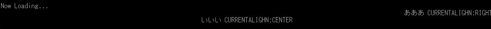

---
hide:
  - toc
---

# ALIGNMENT, CURRENTALIGN

| 函数名                                                                  | 参数      | 返回值   |
| :---------------------------------------------------------------------- | :-------- | :------- |
| [`ALIGNMENT`](./ALIGNMENT.md)    | `keyword` | 无       |
| [`CURRENTALIGN`](./ALIGNMENT.md) | 无        | `string` |

!!! info "API"

    ```  { #language-erbapi }
	ALIGHNMENT keyword
	string CURRENTALIGHN
    ```
    `ALIGNMENT` 之后的文本行将按指定位置对齐。  
    关键字可指定为 `LEFT`、`CENTER`、`RIGHT` 中的任意一个。  
    通常的显示为 `ALIGNMENT LEFT`，即左对齐。  
    通过 `ALIGNMENT CENTER` 可以实现像标题画面那样的居中对齐。  
    `ALIGNMENT` 的效果在换行时生效。
    
    当前的 `ALIGNMENT` 状态可以通过 `CURRENTALIGN` 获取。

!!! hint "提示"

    `CURRENTALIGHN` 支持在表达式中作为函数使用。

!!! example "例" 
    
    ``` { #language-erb title="MAIN.ERB" }
    @SYSTEM_TITLE 
		ALIGNMENT RIGHT
		PRINTFORML あああ CURRENTALIGHN:%CURRENTALIGN()%
		ALIGNMENT CENTER
		PRINTFORMW いいい CURRENTALIGHN:%CURRENTALIGN()%
    ``` 
	