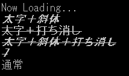

---
hide:
  - toc
---

# FONT operations

| Function name                                                                    | Arguments | Return |
| :------------------------------------------------------------------------------- | :--- | :----- |
| [`FONTBOLD`](./FONT_OPERATION.md)          | none | none   |
| [`FONTITALIC`](./FONT_OPERATION.md)        | none | none   |
| [`FONTSTYLE`](./FONT_OPERATION.md)         | `int`| none   |
| [`FONTREGULAR`](./FONT_OPERATION.md)      | none | none   |
| [`GETSTYLE`](./FONT_OPERATION.md)          | none | `int`  |

!!! info "API"

    ```  { #language-erbapi }
	FONTBOLD
	FONTITALIC
	FONTSTYLE
	FONTREGULAR bitStyle
	int GETSTYLE
    ```
	Changes the text style for subsequent characters.  
	`BOLD` and `ITALIC` can be combined (bold italic).  
	Calling `REGULAR` clears the bold and italic settings.

	`FONTSTYLE` changes subsequent text to the specified style.  
	If 0, normal; if 1, bold (same as `FONTBOLD`); if 2, italic (same as `FONTITALIC`); if 4, strikethrough; if 8, underline.  
	These can be combined bit by bit.  
	For example, FONTSTYLE 3 means bold and italic.  
	`FONTBOLD` and `FONTITALIC` add bold and italic styles to the current style respectively.  
	`FONTREGULAR` is equivalent to `FONTSTYLE 0`, returning to normal style.

	`GETSTYLE` returns the current font style (bold, italic, etc.) in `RESULT:0`.  
	This is the same value specified by the `SETSTYLE` command.  
	If `SETSTYLE` has not been called, it returns `0`.

!!! hint "Hint"

    `GETSTYLE` is supported as an expression function only.


!!! example "Example" 
    
    ``` { #language-erb title="MAIN.ERB" }
    @SYSTEM_TITLE 
		FONTSTYLE 1 + 2
		PRINTL Bold + Italic
		FONTSTYLE 5
		PRINTL Bold + Strikethrough
		FONTITALIC
		PRINTL Bold + Italic + Strikethrough
		PRINTFORML GETSTYLE:{GETSTYLE()}
		FONTSTYLE 0
		PRINTW Normal
    ``` 
	
