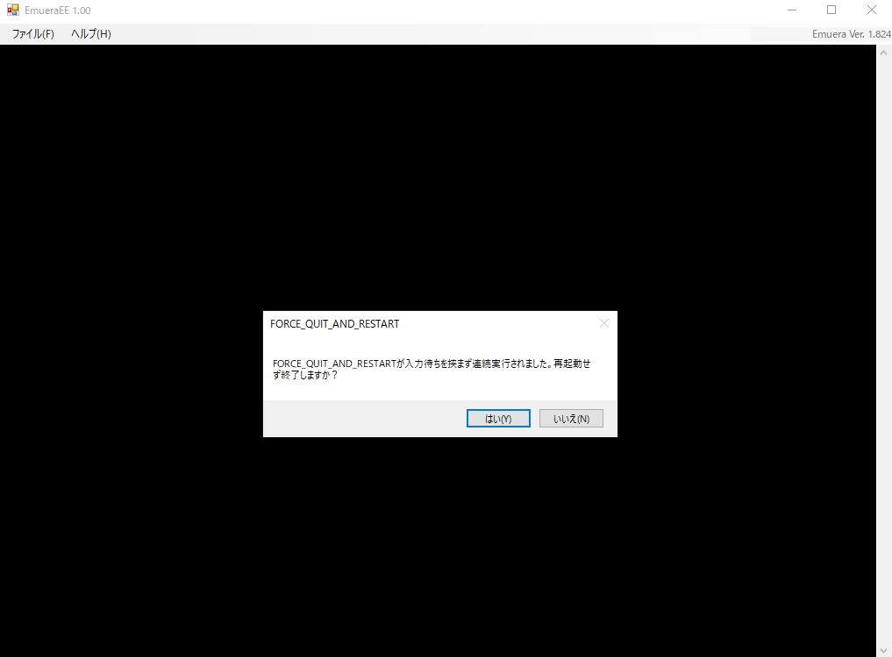

---
hide:
  - toc
---

# FORCE_QUIT_AND_RESTART

| 関数名                                                                                   | 引数   | 戻り値 |
| :--------------------------------------------------------------------------------------- | :----- | :----- |
| [`FORCE_QUIT_AND_RESTART`](./FORCE_QUIT_AND_RESTART.md) | `void` | `void` |

!!! info "API"

	``` { #language-erbapi }
	FORCE_QUIT_AND_RESTART
	```

	`WAIT`を挟まずに`QUIT_AND_RESTART`する

!!! hint "ヒント"

	命令としてのみ使用可能  
	プレイヤーの入力待ちを挟まずに連続実行された場合は、ダイアログボックスで警告を出す

!!! example "例"

	``` { #language-erb title="MAIN.ERB" }
	@SYSTEM_TITLE

		FORCE_QUIT_AND_RESTART
	```

	
