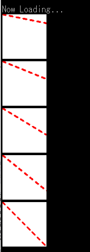

---
hide:
  - toc
---

# GDASHSTYLE

| 函数名                                                         | 参数                  | 返回值 |
| :------------------------------------------------------------- | :---------------------| :----- |
| [`GDASHSTYLE`](./GDASHSTYLE.zh.md) | `int`, `int`, `int` | 1      |

!!! info "API"

	``` { #language-erbapi }
	int GDRAWline gID, DashStyle, DashCap
	```

    指定GDRAWLINE的线条样式。DashStyle和DashCap分别可以使用C#的DashStyle、DashCap枚举的数值来指定。  
    DashStyle 0=普通线条 1=由短划线构成的线条 2=由点构成的线条 3=由短划线和点构成的线条 4=由短划线和两个点构成的线条  
    DashCap(线条端点的形状) 0=普通形状(直角) 2=圆形 3=三角形 1是缺号。有意见请向Microsoft反映。

!!! hint "提示"

	该功能同时支持命令和表达式函数两种形式。

!!! example "示例"

	``` { #language-erb title="MAIN.ERB" }
	@SYSTEM_TITLE
		#DIM DYNAMIC LCOUNT
		FOR LCOUNT, 0, 5
			GCREATE LCOUNT, 100, 100

			GSETPEN LCOUNT, 0xFFFF0000, 5
			
			GDASHSTYLE LCOUNT, 1, 3
			GSETPEN LCOUNT, 0xFFFF0000, 4

			GCLEAR LCOUNT, 0xFFFFFFFF

			GDRAWLINE LCOUNT, 0, 0, 100, (LCOUNT+1)*20

			SPRITECREATE @"LINE{LCOUNT}", LCOUNT
			HTML_PRINT @""
			REPEAT 4
				PRINTL
			REND
		NEXT
		WAIT
	```

	

### 相关项目
- [GDRAWLINE](GDRAWLINE.zh.md)