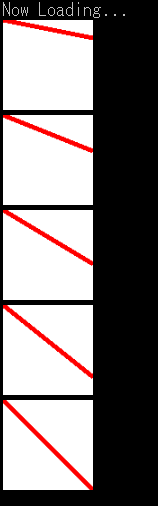

---
hide:
  - toc
---

# GDRAWLINE

| 関数名                                                         | 引数                              | 戻り値 |
| :------------------------------------------------------------- | :-------------------------------- | :----- |
| [`GDRAWLINE`](./GDRAWLINE.md) | `int`, `int`, `int`, `int`, `int` | 1      |

!!! info "API"

	``` { #language-erbapi }
	int GDRAWline gID, fromX, fromY, forX, forY
	```

	`gID`で指定した`Graphics`の`fromX`,`fromY`座標から`forX`,`forY`座標に線を引く  
	線の色と太さは`GSETPEN`で指定したものを使用する

!!! hint "ヒント"

	命令、式中関数両方対応しています。

!!! example "例"

	``` { #language-erb title="MAIN.ERB" }
	@SYSTEM_TITLE
	#DIM DYNAMIC LCOUNT

		FOR LCOUNT, 0, 5
			GCREATE LCOUNT, 100, 100
			GCLEAR LCOUNT, 0xFFFFFFFF
			GSETPEN LCOUNT, 0xFFFF0000, 5
			GDRAWLINE LCOUNT, 0, 0, 100, (LCOUNT+1)*20
			SPRITECREATE @"LINE{LCOUNT}", LCOUNT
			HTML_PRINT @""
			REPEAT 4
				PRINTL
			REND
		NEXT
		WAIT
	```

	

### 関連項目
- [GSETPEN](GSETPEN.md)
- [GDASHSTYLE](GDASHSTYLE.md)
