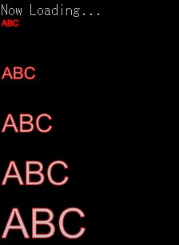

---
hide:
  - toc
---

# GDRAWTEXT

| 函数名                                                         | 参数                            | 返回值 |
| :------------------------------------------------------------- | :------------------------------ | :----- |
| [`GDRAWTEXT`](./GDRAWTEXT.zh.md) | `int`, `string`(, `int`, `int`) | `int`  |

!!! info "API"

    ``` { #language-erbapi }
    int GDRAWTEXT gID, text(, x, y)
    ```

    在 `gID` 指定的 `Graphics` 中绘制 `text`。字体、描边等使用 `GSETFONT` / `GSETPEN` 指定的样式。  
    省略参数 `x` / `y` 时，默认在 `(0, 0)` 的位置绘制。

!!! hint "提示"

    命令 / 行内函数两种写法均有效。

!!! example "示例代码"

    ``` { #language-erb title="MAIN.ERB" }
    @SYSTEM_TITLE
    #DIM DYNAMIC LCOUNT

    	FOR LCOUNT, 1, 6
    		GCREATE LCOUNT, 2000, 300
    		GSETFONT LCOUNT, "Arial", LCOUNT*50, 0
    		GSETPEN LCOUNT, 0xFFFF0000, 5
    		GDRAWTEXT LCOUNT, "ABC"
    		SPRITECREATE @"TEST{LCOUNT}", LCOUNT
    		HTML_PRINT @""
    		REPEAT 2
    			PRINTL
    		REND
    	NEXT
    ```

    

### 相关项目
- [GSETFONT](GSETFONT.zh.md)
- [GSETPEN](GSETPEN.zh.md)
- [GGETTEXTSIZE](GGETTEXTSIZE.zh.md)