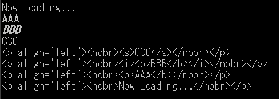

---
hide:
  - toc
---


# HTML_GETPRINTEDSTR

| Function name                                                                               | Arguments | Return  |
| :----------------------------------------------------------------------------------- | :--- | :------ |
| [`HTML_GETPRINTEDSTR`](./HTML_GETPRINTEDSTR.md) | `int`| `string`|

!!! info "API"

    ```  { #language-erbapi }
	str HTML_GETPRINTEDSTR, lineNo  
    ```
	Gets the content of the line specified by `lineNo` from already displayed lines as an HTML-formatted string.  
	The line counting method is the same as `LINECOUNT` and `CLEARLINE` commands.


!!! hint "Hint"

    Both commands and expression functions are supported.


!!! example "Example" 
 
    ``` { #language-erb title="MAIN.ERB" }
    @SYSTEM_TITLE 
		#DIMS HOGES, 4
		FONTBOLD
		PRINTL AAA
		FONTITALIC
		PRINTL BBB
		FONTSTYLE 4
		PRINTL CCC
		FONTSTYLE 0
		FONTREGULAR

		REPEAT 4
			HOGES:COUNT = %HTML_GETPRINTEDSTR(COUNT)%
		REND
		REPEAT 4
			PRINTFORML %HOGES:COUNT%
		REND

		WAIT
    ``` 
	

### See Also
- [GETDISPLAULINE](GETDISPLAYLINE.md)
