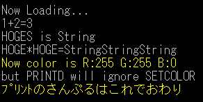

---
hide:
  - toc
---

# PRINT 系

| 関数名                                                                                                                                            | 引数     | 戻り値 |
| :------------------------------------------------------------------------------------------------------------------------------------------------ | :------- | :----- |
| [<code>PRINT(\|V\|S\|FORM\|FORMS)(\|K\|D)(\|L\|W\|N)</code>](./PRINT.md) | `string` | なし   |

!!! info "API"

    ```  { #language-erbapi }
    PRINTV(|K|D)(|L|W|N) expression[, expression, ...]
    PRINTS(|K|D)(|L|W|N) stringVariable
    PRINTFORM(|K|D)(|L|W|N) formedString
    PRINTFORMS(|K|D)(|L|W|N) string
    ```
    PRINT系の基本となる命令です。

    1つ目の括弧内のキーワードは引数タイプを指定します。

    - なし - (<文字列>)
    - V - (<式> [, <式> ……]) — 各引数が独立して評価され、整数式は数値、文字列式はテキストとして出力
    - S - <文字列式>
    - FORM - (<書式付文字列>)
    - FORMS - <書式付文字列式>

    2つ目の括弧内のキーワードの"K"はFORCEKANA命令の適用を指定します。またキーワード"D"はSETCOLOR命令を無視することを指定します。キーワードKとDを同時に指定することはできません。

    - なし - `FORCEKANA`を無視し、`SETCOLOR`で指定された色で描画します。
    - K - `FORCEKANA`を適用して描画します。
    - D - `SETCOLOR`を無視してコンフィグで指定されたディフォルト色で描画します。

    3つ目の括弧内のキーワードは描画後の改行、WAITの有無を指定します。

    - なし - `PRINT`のみで改行や`WAIT`は行いません。
    - L - `PRINT`後、改行します。
    - W - `PRINT`後、改行し`WAIT`命令を行います。
    - N - `PRINT`後、改行せず`WAIT`命令のみを行います。現状では2つ目の括弧内のキーワードKやDと併用できません。
    - これらの組み合わせにより、例えば`PRINTSDW`であれば、引数として<文字列式>を指定し、ディフォルト色で描画し、`PRINT`後に`WAIT`命令を行うことを意味します。

!!! hint "ヒント"

    命令のみに対応しています。

!!! example "例"

    ``` { #language-erb title="MAIN.ERB" }
    @SYSTEM_TITLE
    #DIM HOGE
    #DIMS HOGES
    	PRINT 1+2=
    	HOGE = 3
    	PRINTV HOGE
    	PRINTL
    	PRINT HOGES is
    	HOGES = String
    	PRINTSL HOGES
    	PRINT HOGE*HOGE=
    	PRINTFORMSL HOGES*HOGE
    	SETCOLORBYNAME yellow
    	HOGE = GETCOLOR()
    	PRINTFORML Now color is R:{HOGE/0x10000} G:{HOGE/0x100%0x100} B:{HOGE%0x100}
    	HOGES = but PRINTD will ignore SETCOLOR
    	PRINTSDL HOGES
    	HOGES = サンプルはこれでおわり
    	FORCEKANA 2
    	PRINTK ﾌﾟﾘﾝﾄの
    	PRINTFORMKW %HOGES%
    ```
    

### 関連項目
- [PRINTBUTTON](PRINTBUTTON.md)
- [BITMAP_CACHE_ENABLE](BITMAP_CACHE_ENABLE.md)
- [Emueraで追加された記法>書式付き文字列（FORM構文）拡張](../Emuera/expression.md#form_1)

