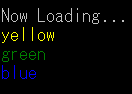

---
hide:
  - toc
---

# SETCOLORBYNAME, SETBGCOLORBYNAME

| 関数名                                                                         | 引数        | 戻り値 |
| :----------------------------------------------------------------------------- | :---------- | :----- |
| [`SETCOLORBYNAME`](./SETCOLORBYNAME.md)   | `colorName` | なし   |
| [`SETBGCOLORBYNAME`](./SETCOLORBYNAME.md) | `colorName` | なし   |

!!! info "API"

    ```  { #language-erbapi }
	SETCOLOBYNAME colorName
	SETBGCOLORBYNAME colorName
    ```
	定義済み色名からフォント表示色や背景色を指定する命令です。  
	他の仕様はすべて[`SETCOLOR`](./SETCOLOR.md)・[`SETBGCOLOR`](./SETBGCOLOR.md)と同様です。引数は色名です。定義済み色名については[KnownColor列挙体](https://learn.microsoft.com/ja-jp/dotnet/api/system.drawing.knowncolor)に準拠しておりますので、そちらを参照してください。  

!!! hint "ヒント"

    命令のみ対応しています。


!!! example "例" 
    
    ``` { #language-erb title="MAIN.ERB" }
    @SYSTEM_TITLE 
		SETCOLORBYNAME yellow
		PRINTL yellow
		SETCOLORBYNAME green
		PRINTL green
		SETCOLORBYNAME blue
		PRINTW blue
    ``` 
	
