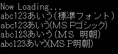

---
hide:
  - toc
---

# SETFONT 系命令

| 函数名                                                         | 参数     | 返回值   |
| :------------------------------------------------------------- | :------- | :------- |
| [`CHKFONT`](./SETFONT.md) | `string` | `int`    |
| [`SETFONT`](./SETFONT.md) | `string` | 无       |
| [`GETFONT`](./SETFONT.md) | 无       | `string` |

!!! info "API"

    ```  { #language-erbapi }
	int CHKFONT fontName
	SETFONT fontName
	string GETFONT
    ```
	`CHKFONT` 用于检查指定名称的字体是否已安装。  
	如果已安装，则 `RESULT:0` 被赋值或返回 1；如果未安装，则赋值或返回 0。  

	`SETFONT` 指令使后续的字符串显示使用指定名称的字体。  
	如果省略参数或指定空字符串，则恢复为 [`emuera.config` 中指定的标准字体](../Emuera/config.md#_31)。  
	如果指定的字体未安装，则将使用 `Microsoft Sans Serif` 作为替代。  
	当指定可能未安装的字体时，请在 `SETFONT` 之前参考 `CHKFONT` 的结果。

    `GETFONT` 会将当前使用的字体名称赋值或返回到 `RESULTS:0` 中。  
    这与 `SETFONT` 命令指定的名称相同。  
    当未执行 `SETFONT` 命令时，将赋值 [`emuera.config` 中指定的标准字体](../Emuera/config.md#_31) 的名称。

    这些分别是 EM+EE 的附加功能，现在也可以使用 Emuera 同目录下 `font` 文件夹内的 `ttf`、`otf` 字体文件了。

!!! hint "提示"

    `CHKFONT`、`GETFONT` 支持在表达式中作为函数使用。

!!! example "例" 
    
    ``` { #language-erb title="MAIN.ERB" }
    @SYSTEM_TITLE 
		PRINTL abc123あいう(標準フォント)
		CHKFONT "ＭＳ Ｐゴシック"
		IF RESULT
			SETFONT "ＭＳ Ｐゴシック"
			PRINTL abc123あいう(ＭＳ Ｐゴシック)
		ENDIF
		CHKFONT "ＭＳ 明朝"
		IF RESULT
			SETFONT "ＭＳ 明朝"
			PRINTL abc123あいう(ＭＳ 明朝)
		ENDIF
		STR:0 = ＭＳ Ｐ明朝
		CHKFONT STR:0
		IF RESULT
			SETFONT STR:0
			PRINTL abc123あいう(ＭＳ Ｐ明朝)
		ENDIF
		SETFONT
    ``` 
	