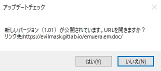

---
hide:
  - toc
---

# UPDATECHECK

| 函数名                                                             | 参数   | 返回值 |
| :----------------------------------------------------------------- | :----- | :----- |
| [`UPDATECHECK`](./UPDATECHECK.md) | `void` | `int`  |

!!! info "API"

    ``` { #language-erbapi }
    UPDATECHECK
    ```

    从 `GameBase.csv` 配置的 `バージョン情報URL` 获取最新版本信息，如果当前版本不是最新版则弹出对话框提醒更新。

    1. `./csv/GameBase.csv` 新增「バージョン名」「バージョン情報URL」配置项。  
        `バージョン名` 是字符串类型的任意格式版本号，`バージョン情報URL` 是确认最新版本信息用的 URL。
    2. 上述记载的 URL 应该响应最新版本的版本号和下载地址。  
        第 1 行写最新的版本号，第 2 行写最新的资源下载地址，第 3 行及之后可以写任意备注文本。  
        如果你使用的是公开的 Git 仓库，可以把最新的版本信息推送到远程存储库，通过 raw 格式进行访问。
    3. 执行 `UPDATECHECK` 时访问 `GameBase.csv` 配置的 URL（更新信息地址）。  
        如果当前版本已经是最新版，将 `RESULT` 赋值为 `0`，结束。  
        如果当前版本与最新版本不同，弹出对话框询问玩家是否打开云端记载的最新版本资源地址。
    4. 如果选择「いいえ（不更新）」，将 `RESULT` 赋值为 `1`，除此之外什么都不做；  
        如果选择「はい（更新）」，将 `RESULT` 赋值为 `2`，并打开默认浏览器访问最新版本资源地址；  
        如果因为任意原因失败（访问更新信息地址失败，更新信息地址的响应结果中没有包含版本信息 / 最新版本资源地址等等），将 `RESULT` 赋值为 `3`。

!!! hint "提示"

    只能作为命令使用。

!!! example "示例代码"
    ``` { #language-csv title="GameBase.csv" }
    バージョン情報URL, https://gitlab.com/EvilMask/emuera.em.doc/-/raw/master/version.txt
    バージョン名, 1.00
    ```

    ``` title="version.txt"
    1.01
    https://evilmask.gitlab.io/emuera.em.doc/
    ```

    ``` { #language-erb title="MAIN.ERB" }
    @SYSTEM_TITLE
        UPDATECHECK
    ```

    
