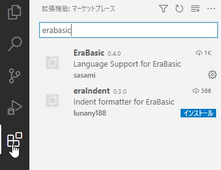
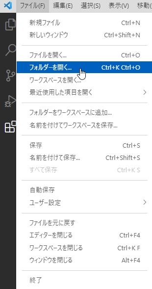
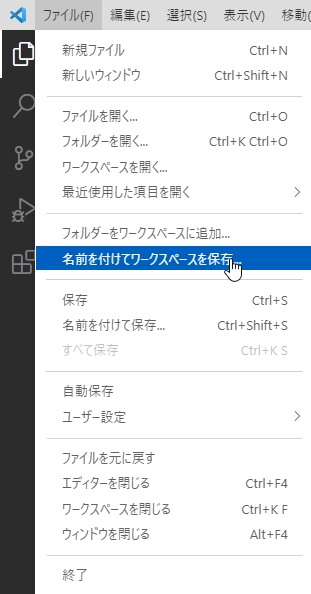
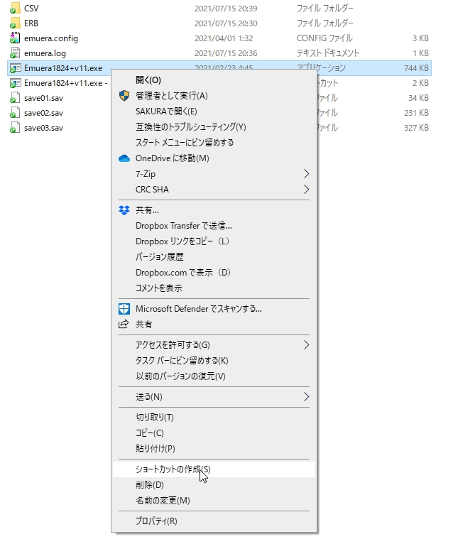
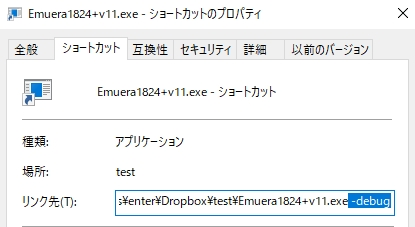
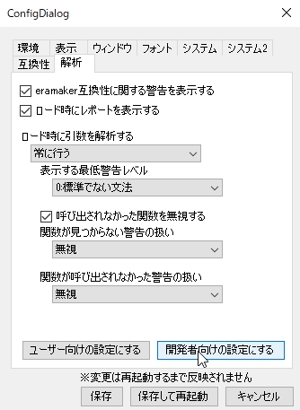
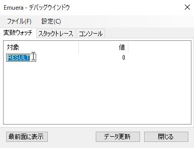
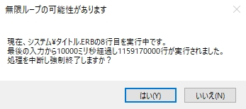

# バリアント製作/ERB製作実践編  

元となったページ  
[eraシリーズを語るスレ まとめWiki V3 ERB製作実践編](https://seesaawiki.jp/eraseries/d/ERB%c0%bd%ba%ee%bc%c2%c1%a9%ca%d4)

---

- [チュートリアル](erawiki-tutorial.md)
- [タイトル準備編](erawiki-title.md)
- [タイトル実践編](erawiki-title2.md)
- ERB製作実践編

---

当ページはDiscordのとあるサーバーの発言をまとめたものです  

- [Discord - eraEVENT_KXX](https://discord.gg/cuSh6y5j93)


[タイトル実践編](erawiki-title2.md)から続いてERBの実践的な内容を説明  

---

## VSCodeの導入方法について  
PDF形式で詳しく説明されたものもある。こちらのほうが本格的で分かりやすい  
- [eraVSCode：ダウンロード](http://book-shelf-end.com/up/dwlink.cgi?eraRx3299.zip)  

- 1,公式サイトからダウンロードしてインストールする  
[nVisual Studio Code - コードエディター Mirosoft Azure](https://azure.microsoft.com/ja-jp/products/visual-studio-code/)  
<br>  

- 2,左にあるタブから拡張機能を選び、erabasicで検索してERB用のプラグインをインストールする  
  

- 3,左上の「ファイル」タブからバリアントなり口上なりのフォルダを開く  
  

- 4,この時点でエディタの環境は出来上がるが、ワークスペースを保存しておく  
  

- 5.erabasic拡張機能のおかげでERBファイルが見やすくなる  
上記は「Visual Studio Code(VSCode)」の導入方法を説明したが、似た名前の「Visual Studio」という名前のアプリもあるので気をつけよう  
Visual Studioはコンパイル・ビルド・デバッグ等を行う言語のための統合開発環境(IDE)なので、ソースコードエディタであるVSCodeとは別物  
Emueraにコード読ませるだけで済むerabasicならVSCodeがいい  
有志のERB用プラグインのおかげで関数定義にジャンプするのも簡単だし  
（関数・変数）定義への移動があるから、初見のバリアントで「ここで`CALL`してる関数はどのファイルにあるんだろう」と探す手間が省けるのがポイント  
多くの関数がひとつのファイルにまとまってる場合でもアウトライン機能があるからフットワークの軽い制作ができる  
Gitとの連携も可能  

---

## 変数の種類について  
eraで初めてプログラミング触りますという人なら「変数って何？」と思う人も多いはず  
散々説明されてる通り変数とは箱のようなもの。もう本当に手垢が付いた解説にしかならないので割愛  
この概念を調べるために「変数」とググると、`boolean`だの`double`だの`float`だのいろんな種類が出てきて混乱するのは初心者あるあるだろう  
他言語ではいろんな種類がある変数も、Emueraで使われるのは2つ、`str`(`string`)型と`int`(`integer`)型だけ  

>`str`型(`string`型、文字列型) 変数の中身が文字の変数。数字を含めあらゆるデータを格納できる  
>`int`型(数値型) 変数の中身が数字の変数。数字しか入れられないが、計算に強い  

文字を入れるものと数字を入れるもの、この2つしか概念が無いのでEmueraを使う場合はひとまず他の変数は忘れよう  
はじめからEmueraで使用可能な変数にも数値型と文字列型があるものの、変数の名前にSTRやSが付いてるものは文字列型という雰囲気がある。「`CSTR`」「`LOCALS`」「`ARGS`」「`GLOBALS`」などは文字列型である  

eraをプレイしていても馴染み深い「○○日目」とか「所持金○○圓」とかは数値型変数が使われている  
そして「あなた」含めてキャラクターの名前には文字列型が使われている  

後者で使われてるのは`NAME`や`CALLNAME`といった変数。変数名の通りキャラ名と呼び名(略称)  
`ITEMNAME`(道具の名前)や`TRAINNAME`(コマンドの名前)などの変数もあるが、ERBで参照することはあっても代入することはないので、最初は覚えなくても大丈夫。のはず  

## `CFLAG`、キャラクタ変数、口上で使える変数について  
`CFLAG`は、多くの場面で`CFLAG:XX`と省略されて書かれてるので`FLAG:XX`などと同じに見えるが、キャラクタ変数という二次元配列変数である  
どの変数がキャラクタ変数なのかはEmueraWikiの変数表に書かれている  

- [定数・変数 - 暫定的な仕様表](../Emuera/variables.md#_21)  

`FLAG`等の一次元配列なら`FLAG:XX`は横一列に並んだ箱、`CFLAG`等の二次元配列ならさらに縦にも並べた箱、となる  
「`CFLAG:3:2`」だったら3列目の前から2番目を指定してることになる（正確には0から数えるので4列目の前から3番目）  
これが`CFLAG:2`と省略されている場合は「`CFLAG:TARGET:2`」と自動で補完されて処理される  
`TARGET`（調教対象）の処理が多くなりがちなeraにとってはコードを書きやすくする仕様といえる  

そして中でもキャラクタ変数は、上記「`CFLAG:3:2`」の3の部分がキャラに対応している  
つまり「3人目のキャラの2番目のステータス」となる  
もちろんのこと`CFLAG:3:XX`を弄っても`CFLAG:1:XX`(1番目のキャラのステータス)には影響しない  
これによって口上で独自のイベントを作る場合等に、他のキャラを侵害しないものが作れる  

ただし`CFLAG`を口上で使えるのは、eraTWのように「`CFLAG`の1000～1999は口上で自由に使っていいよ」と明示されてるバリアントのみ  
それが明示されていないバリアントで、口上で勝手にCFLAGを書き換えると、本体の動作に支障をきたす場合がある。注意しよう  

では次に「口上で使える`CFLAG`が無いんですけど！」と「`CFLAG`はバリアントで使ってるから口上で使われると困るんですけど！」を、口上作者とバリアント作者の両方の視点から説明する  

これを解決するのが「変数定義」と「ERHファイル」  

- [ユーザー定義の変数](../Emuera/user_defined_variables.md)
- [ヘッダーファイル(ERH)](../Emuera/ERH.md)

ひとつの関数内で完結して、かつ進行状況がセーブされなくてもいい単発のイベントを口上で作りたい場合、関数名の下に`DIM`を使って変数を作ると便利  
たとえば「今日はクリスマスです」的なシチュで分岐作るときに「`CHRISTMAS`」という変数を作ったり  

``` { #language-erb title="ERB" }
@XXXX;口上用の関数  
#DIM DYNAMIC CHRISTMAS  
```

「ひとつの関数じゃ足りない 他の関数を跨いだもっと大規模なイベントを作りたい」という時に使うのはERHファイル  
こちらを使うと、どの関数でも使えてセーブもされる変数を作ることができる  
たとえば「特定のコマンドを実行した回数」を記録して、「こういうコマンドが好きなんですね」と言わせるような分岐に使える  

以下、キャラ番号が3のキャラの口上で使う変数をERHファイルで定義する場合の例文を挙げる  

``` { #language-erb title="ERB" }
#DIM SAVEDATA KOJOFLAG3, 10  
```

上記の例文は「`KOJOFLAG3`」という名前のセーブされる変数を、0～9まで使えるように定義したものである  
拡張子がERHのファイルを用意してこの1行を追加するだけで変数の定義は完了となる  
口上側で使えるフラグが事前に用意されてるバリアントもあるが、無い場合はこのように自分で用意するのも口上を作る上でひとつのテクニックといえる  

バリアント作者が口上用にフラグを用意しておきたい場合も、ERHを使用する。口上で自由に使えるキャラクタ変数を定義するだけ  
たとえばeratohoЯeverseなら口上用に`KFLAG`という変数が用意されてたりする  
ERHファイル内に  

``` { #language-erb title="ERB" }
#DIM SAVEDATA CHARADATA KOJOFLAG, 100  
```

と書いたものを作って、「`KOJOFLAG`の0～99は口上で自由に使ってね」とreadmeあたりに書いておけば解決  
上記の例文はキャラクタ変数となるため、単一のキャラに複数の口上があるケースでない限りは競合せずに変数を使える  

`CHARADATA`を使ってキャラクタ変数を作るときは、`SAVEDATA`を併記しないとセーブされないキャラ変数になるので注意。ほとんどの口上はセーブされる変数を望んでいるはず  

---

## IF～ENDIF、SELECTCASE～ENDSELECT、そしてインデントについて  
eraでは分岐を作る際、最初に覚えるのが`IF`と`ENDIF`だと思われる  
これは必ず一組で使わないとエラーになる。応用の`SELECTCASE～ENDSELECT`も同様  
`IF`をひとつ使ったら、`ENDIF`もひとつ必要になる。`IF`を5個使えば当然5個の`ENDIF`が必要  
「ソースコードを書く上でわざわざ使った数を数えてられないよ！」という意見はごもっともである。それを解決するのがインデントと呼ばれる行揃え  

ほとんどのエディタではTabキーを押せば半角スペース4個分くらい空白を入れてくれる  
これらはソースコードの動作には一切影響しない  
「何個使ったっけ？」と曖昧になる前に、一対の`IF`と`ENDIF`をインデントで揃えておくと分かりやすいのである  

`IF～ENDIF`と同じくらい頻繁に使われている`SELECTCASE～ENDSELECT`は、`SELECTCASE～CASE～ENDSELECT`と三位一体の書き方になる  
`IF`文と`SELECTCASE`文のインデントがどうなるか実際に見てみよう この例文では`FLAG:0`を用いる  

``` { #language-erb title="ERB" }
IF FLAG:0 == 0  
    PRINTW FLAG:0の中身は0です  
ELSEIF FLAG:0 == 1  
    PRINTW FLAG:0の中身は1です  
ELSE  
    PRINTW FLAG:0の中身は0でも1でもありません  
ENDIF  

SELECTCASE FLAG:0  
    CASE 0  
        PRINTW FLAG:0の中身は0です  
    CASE 1  
        PRINTW FLAG:0の中身は1です  
    CASEELSE  
        PRINTW FLAG:0の中身は0でも1でもありません  
ENDSELECT  
```

この通り、`IF`文と`SELECTCASE`文では微妙にインデントが違うのである  
この微妙な違いは初心者にはかなり難解だと思われる  
なので「口上テンプレートを用いない」「用いても独自の分岐を組み込んでみる」といった場合は、最初は`IF～ENDIF`で統一するのが混乱を避けられる。口上に限らずバリアント側でも同様  

基本的に`SELECTCASE`で出来ることは全て`IF`でも出来るため、慣れないうちは無理に`SELECTCASE`を使う必要はない  
インデントを使うのも`SELECTCASE`を使うのも「ソースコードを見やすくするため」であって、最初から見栄えまで良くしようというのは初心者には難易度が高い。エラーと格闘しながら覚えていこう  

コードを書くときは上から1行ずつ書くのではなく、関数や分岐などの構造を先に書いておくといい  
中身の`PRINTW`とかを書く前に`IF`と`ELSEIF`と`ENDIF`を先に書いておけば閉じ忘れも無くなる  

`IF`と`SELECTCASE`に関する参考資料  

- [システム改造Q&A - IF・ELSEIFのかたまりはSELECTCASE文に出来るかも](erawiki-modification-QandA.md#ifelseifselectcase)

---

## 関数と`CALL`について  
ERBファイルの中には「`@XXX`」と書かれた、アットマークから始まる行がある  

獏公式の「関数について」の項目が分かりやすい  

- [eramakerのera basic書式](../eramaker/ERB_format.md#_4)  

>プログラムを最初から最後まで続けて書くとわかりづらいものです。  
>部分部分に切り分けてわかりやすくするためには、「関数」を使います。  

関数はERBファイルであればどこに作ってもいい。Emuera起動時点でディレクトリ内の全てのERBファイルが読み込まれるので、ディレクトリ(フォルダ)の構造も関係無い  
今のほとんどのバリアントでは分かりやすくフォルダ分けがされている。この通り、フォルダの下にあるERBファイルも読み込んでくれる  
関数は実際の処理で`CALL`されて使われるもの。ゲーム開始時の関数は`@SYSTEM_TITLE`で、ここからゲームが広がっていく  
ファイル名は全く関係無く、ERBファイルの中の関数単位で読み込まれる  
フォルダの中にあるERBファイル、さらにERBファイルの中にある関数、と、ERBファイルそのものもフォルダと似たようなものと思えば分かりやすい  

そしてその関数を呼び出すのが`CALL`命令  

``` { #language-erb title="ERB" }
PRINTFORMW これは口上です  
```

この書き方は「これは口上です」という文を「画面に表示する」、`PRINT`命令を使った行となる  

``` { #language-erb title="ERB" }
CALL KANSUU  

@KANSUU  
PRINTFORMW 関数が呼ばれました  
```

この書き方は「`@KANSUU`」という関数を「呼び出す」処理をした後、「関数が呼ばれました」という文を「画面に表示する」処理  

このように、「画面に表示する」「呼び出す」といった動作を行うものが「命令」と呼ばれるコードである  
`PRINTFORMW`も`CALL`も命令なので、その後に続くコードに応じて動いてるということだ  
この命令という概念が大事。これが分かると、上で説明した`IF～～`や`SELECTCASE～～`も命令だったんだなぁと気づく  
変数、関数、命令、eraを作る上で重要な概念が3つ。これを理解すると出来ることが大幅に増える  

次は関数の作り方を説明する  
「`CALL`で関数に移動するのは便利そう！」「ところで関数ってどうやって作るの？難しいの？」いいえ、まったく難しくありません  

ERBファイル内に`@～～`と書けば関数の出来上がり。本当にこれだけ  

上記の例文だと  

``` { #language-erb title="ERB" }
@KANSUU  
```

この一行だけで関数が作られてるのである。難しいことは一切無く、他の関数と被らない名前を付けて、`CALL`で呼べばもうマスターしたも同然  
先述の通り関数とはフォルダの中のファイルと同等なもので、他の関数の途中に関数を挟むのは間違った書き方なので注意  
`@～～`の関数が一区切りついてるのを確認してから作ろう  
もちろん「他人の作ったERBファイルをいじるのは不安！」という時には、自分でERBファイルを作ってそこに関数を作ってもいい  

ここまでで関数の概念と作り方について説明した。これで十分`CALL`の実践はできるが、いくつかの留意事項を挙げておこう  
ひとつは「`CALL`を使って別の関数が呼ばれたあと、元の`CALL`の場所まで戻ってくる」ということ  

``` { #language-erb title="ERB" }
PRINTFORMW 家を出て羽田空港につきました  
CALL USA  
PRINTFORMW 羽田空港から家に戻りました  

@USA  
PRINTFORMW 国際便でアメリカ旅行して戻ってきました  
```

処理の流れを旅行者にたとえるとこういう動作をする  

もうひとつは、関数名には日本語も使えるということ  
ただしこちらは「こっちのほうが見やすいかな」程度のものだから、無理に日本語で使う必要もない  

``` { #language-erb title="ERB" }
CALL 関数  

@関数  
PRINTFORMW 関数が呼ばれました  
```

上記の`@KANSUU`を使った例文を日本語に置き換えただけ。これで問題なく同じ動作をする  

最後に、この解説ではあえて`CALL`だけ説明したが、同じく関数を呼ぶ命令では`JUMP`や`CALLFORM`、`TRYCCALLFORM`など上位モンスターみたいなやつらがいる。これらは最初は覚える必要は無いので「こういう処理を作りたい」と閃いたときに調べてみよう  

---

## 変数と代入、演算について  

※以下「演算」という言葉が聞き慣れない人は「計算」と同義なのでその解釈でOK  

変数の種類については説明した。今回はこの変数の中身を変える様々な方法を解説したいと思う  
まず前提として、数値型の変数には数値、文字列型の変数には文字しか代入できない点に注意  
代入と言われる、変数の中に特定の値を入れる処理には数値型文字列型共に「`=`」を使う  

``` { #language-erb title="ERB" }
@TEST  
#DIM INT  

INT = 123  
STR = ABC  

PRINTFORMW {INT} %STR%  
```

`#DIM`の使い方は当ページで説明した通り。`@TEST`関数を呼び出すと「123 ABC」と表示されるはず  
変数`INT`に`123`を代入して、変数`STR`には`ABC`と代入してるからである。代入の部分を書き換えれば表示される文も変わる  

ここでもうひとつ説明できるのが、`PRINTFORMW`で変数の中身を表示する方法  
数値型変数は`{}`で囲むことで、文字列型変数は`%%`で囲むことで中身を表示できる  
日数や所持金を表示する際に  

``` { #language-erb title="ERB" }
PRINTFORML 主人:%CALLNAME:MASTER% {DAY}日目 所持金:{MONEY}円  
```

と書けば必要な情報は表示されることになる。`PRINTFORML`というのはクリック待ちをしない場合  

また、上記の`123`や`ABC`のように指定の値を入れる際に演算子を使うことができる  
演算子というのは、算数や数学における計算記号。「`+`」「`-`」掛け算は「`*`」割り算は「`/`」など  

``` { #language-erb title="ERB" }
@TEST  
#DIM INT  
#DIM PLUS  

PLUS = 45  
INT = 123+PLUS  

PRINTFORMW {INT}  
```

上記の例文で表示されるのは168となる。123+45の中身を表示している  

``` { #language-erb title="ERB" }
@TEST  
#DIM INT  
#DIM PLUS  

PLUS = 45  
INT = 123  

PRINTFORMW {INT+PLUS}  
```

こういう書き方もできる。同じく結果は168  
処理は上の行から行われるため、先に`PLUS`変数に代入するのが大事  

基本は前述した「`+`」「`-`」「`*`」「`/`」この4つの演算子。単純だが、これらはera開発でずっと付き合うことになるのでマスターしたい  
それ以外の演算子については次項から説明する  

---

## 比較演算子と`true`、`false`について  
プログラミングでは古くから`true`、`false`という概念がある。「変数の種類」の項で触れた`boolean`がそれにあたる  
`true`か`false`かは変数に入るものだが、erabasicにはこれも同項の通りint型変数とstr型変数しかない  
これをEmueraでは、数値型変数の中身が0の場合は`false`、それ以外は全て`true`の扱いになっている  

これを踏まえて比較演算子というものを説明しよう  
主に`IF`で使われる。以下のコードは、eraであればどこでも使われているメジャーな例文  

``` { #language-erb title="ERB" }
IF CFLAG:0 >= 1  
  PRINTFORMW CFLAG:TARGET:0は1以上です  
ELSE  
  PRINTFORMW CFLAG:TARGET:0は0以下です  
ENDIF  
```

比較演算子は、`IF`のあとに変数、演算子と、また別の変数や数値の組み合わせで使われている  
これは`CFLAG:0`が1以上だった場合に上の分岐を表示して、それ以外なら下の分岐を表示するという処理になる  
英語の`IF`及び`ELSE`の意味と同じと言えばイメージしやすいと思われる  

獏公式の「条件判断する」の項に基本的なことが載っている  
[eramakerのera basic書式](../eramaker/ERB_format.md)

`IF`についてイマイチよく分からないなって方はこちらも読んでみるといいかも  
[タイトル実践編 - IF](erawiki-title2.md#if)

`IF`のあとに続いた条件式が満たされている場合に`IF`下の処理が実行されるのは前述の通り  

そして使える比較演算子は以下の通り  

>X < Y , XがY未満の場合  
>X > Y , YがX未満の場合  
>X >= Y , XがY以上の場合  
>X <= Y , YがX以上の場合  
>X == Y , XとYが等しい場合  
>X != Y , XとYが等しくない場合  

`>`と`>=`は少し違うので注意。両方が同じ値だった場合に違う結果になる  
`==`については上で話した代入の処理とはまったく別物  
上の6つの比較演算子は、基本的に2つの値を比べるものなので、ひとつの条件で原則1個しか使えない。それ以外の、比較しない演算子は使える  

``` { #language-erb title="ERB" }
IF X+Y >= 10  
  PRINTFORMW {X}+{Y}は10以上です  
ELSE  
  PRINTFORMW {X}+{Y}は10未満です  
ENDIF  
```

このように、比較演算子とは別に前項で説明した演算子が使える  

この`IF`での条件式は複数設定することもできる。その場合は`&&`、`||`といったまた別の種類の演算子が出てくる。これは次項で説明する  

「で、結局冒頭で話した`true`と`false`って何だったの？」と思う方もいるだろう  
`IF`の後で条件を満たしている状態が`true`(`1`)、満たしてない場合が`false`(`0`)なのである  
なので極端な書き方をすれば  

``` { #language-erb title="ERB" }
IF 1  
  PRINTFORMW trueです  
ELSE  
  PRINTFORMW falseです  
ENDIF  
```

こういうことになる  

もちろんのことながら`1`は`true`で常に`IF`の条件を満たしているので、`ELSE`下の「`false`です」は絶対に表示されない  
`0`(`false`)を条件式にした場合も同様  

``` { #language-erb title="ERB" }
IF 0  
  PRINTFORMW falseです  
ELSE  
  PRINTFORMW trueです  
ENDIF  
```

ELSE下は絶対に(ry  

冒頭で話したとおり`0`だけ`false`、それ以外は(マイナスの値だろうが)すべて`true`扱いなので、「`IF`使ってるのに比較演算子が無いよ！」という場合はこの仕組みを使っている  

``` { #language-erb title="ERB" }
IF MONEY  
  PRINTFORMW お金を持っています 所持金は{MONEY}円です  
ELSE  
  PRINTFORMW 所持金は0円です  
ENDIF  
```

`MONEY`変数みたいに大きな値を取る変数ではあまり使われないが、比較演算子を省略したときの意味としてはこうなる  
フラグが立っているかどうか、みたいな単純な分岐を書く時に便利  

---

## ひとつの`IF`分岐に複数の条件を指定する方法  
比較演算子は一つの条件式に一つまで、「`+`」や「`-`」などの算術演算子は制限無しと説明した  
今回説明するのはこれらとはまた違う、論理演算子と呼ばれるもの  

基本的には以下の3つ  

|演算|解説|
|:-|:-|
| 条件式1 `&&` 条件式2 | 条件式1と2を両方満たす場合に分岐を実行(true)|
| 条件式1 `\|\|` 条件式2 | 条件式1か2、どちらかを満たす場合に分岐を実行|
|`!`条件式 | 条件式が満たされていた場合にfalseを、満たしてないとtrueになる|

これらは条件式の数をそのまま増やすため、上述の「比較演算子は一つの条件式につき一つまで」のルールも、条件式1と2で適用される  
`&&`と`||`の演算子を使えば条件式はいくらでも増やすことができる  

``` { #language-erb title="ERB" }
IF CFLAG:0 == 0 && FLAG:0 == 0 && STR:0 == ""  
  PRINTFORMW CFLAG:0とFLAG:0とSTR:0には何も代入されていません  
ENDIF  
```

これは`&&`(AND,論理積)を使った式。条件が全て満たされている場合に分岐  
このように条件式を3つ以上設定したり、数値型の条件と文字列型の条件を一緒に使えたりする  

``` { #language-erb title="ERB" }
IF CFLAG:0 != 0 || FLAG:0 != 0 || STR:0 != ""  
  PRINTFORMW CFLAG:0とFLAG:0とSTR:0のどれかに値が代入されています  
ENDIF  
```

こっちの式は`||`(OR,論理和)を使った式 どれかひとつでも満たされている場合に分岐  

見ての通り`&&`は条件が厳しいので、`||`のほうが分岐を通りやすい  
それは言い換えると、意図していない分岐を実行するコードになることも多々ある  
たとえば  

``` { #language-erb title="ERB" }
IF (CFLAG:0 == 0 || (FLAG:0 == 0 && STR:0 == "") || TEQUIP:0 == 0) && (CSTR:0 == "" || TFLAG:0 == 0)  
  PRINTFORMW ???  
ENDIF  
```

こうなるともはや書いている側も読んでいる側も、どういう処理を実行するのか非常に難解となる  

一つの`IF`分岐の中で`&&`と`||`を両方使うこともできる。ただし使いすぎると可読性が著しく下がるため、おすすめはしない  
特に初心者のうちは情報を増やしすぎるとどこを間違えてるのかすら判別できなくなる。まずは条件式3つくらいを上限にしてやってみよう  
条件式3つで`&&`と`||`を混在させた例を書くと  

``` { #language-erb title="ERB" }
IF (CFLAG:0 == 0 || FLAG:0 == 0) && STR:0 == ""  
  PRINTFORMW CFLAG:0とFLAG:0のどちらかは0で、かつSTR:0は空文字列です  
ENDIF  
```

`||`を使ったOR分岐は基本的に括弧でまとめることになる。掛け算や割り算と同じく計算の順序を守るためである  

---

## 文字列変数の演算について  
これまでは数値型変数の演算について説明していた。この項では文字列型変数の演算について説明しよう  
まず共通のこととして、代入は数値型と同じ「`=`」を使う  
ただし、この代入の書式が少々曲者で、いくつかのルールがある  

``` { #language-erb title="ERB" }
@TEST  
#DIM DYNAMIC INT  

INT = 1  
STR = AAA  
PRINTFORMW INTは{INT}です STRは%STR%です  
```

これの結果についてはここまで読んだ人ならある程度予測が付くだろう  
変数`INT`及び`STR`の中身を表示する  
では次の例文ならどうだろう  

``` { #language-erb title="ERB" }
@TEST  
#DIM DYNAMIC INT, 2  

INT:0 = 1  
INT:1 = INT:0  

STR:0 = AAA  
STR:1 = STR:0  

PRINTFORMW INT:1は{INT:1}です STR:1は%STR:1%です  
```

「配列」のおさらいも兼ねている。`INT:0`と`INT:1`は別の変数なので別の値を入れられるし、`INT:0`の中身を上記のように`INT:1`にコピー(代入)もできる  
「結果はさっきのと同じじゃないの？」と思うかもしれないけど、違う  

`INT`は数値型変数なので、`INT:0`を変数と自動で解釈して`INT:1`にも1が入れられる  
ただし文字列型の代入は変数と解釈してくれないので、`STR:1`の中身は「`AAA`」ではなく「`STR:0`」という文字列がそのまま代入されている  

「変数の中身を参照したいんだよ！」という場合に使える記法はいくつかある  
まずは`PRINTFORMW`系と同じく「`%%`」で括って代入すること  
上記の例文を  

``` { #language-erb title="ERB" }
STR:1 = STR:0  
;↓  
STR:1 = %STR:0%  
```

に変更してみると、`STR:0`が変数として解釈され、`STR:1`には`AAA`が代入される  
この代入は変数と非変数が混在していても動く 数値型も同様  

``` { #language-erb title="ERB" }
@TEST  
#DIM DYNAMIC INT, 2  

INT:0 = 1  
INT:1 = INT:0+3  

STR:0 = AAA  
STR:1 = BBB%STR:0%CCC  

PRINTFORMW INT:1は{INT:1}です STR:1は%STR:1%です  
```

こう書いた場合は`INT:1`には1+3の「4」が、`STR:1`には「BBBAAACCC」という文字が代入される  

文字列型の代入にはもうひとつ方法がある 「`'=`」を用いる記述  

``` { #language-erb title="ERB" }
STR:0 = AAA  
STR:1 '= STR:0  

PRINTFORMW STR:1は%STR:1%です  
```

この記述なら%%で括らなくても変数と解釈してもらえるので、`STR:1`の中身は「AAA」になる  

はっきり言って、似てるのに違う2つの記法があると混乱は必至。どちらを使うかを最初に決めておいて、片方は一旦忘れるくらいでいいと思う  
「『`'=`』を使って上のBBBAAACCCみたいにやるにはどう書くの？」という質問もあると思われる  
その場合は、  

``` { #language-erb title="ERB" }
STR:0 = AAA  
STR:1 '= @"BBB%STR:0%CCC"  

PRINTFORMW STR:1は%STR:1%です  
```

と書く `@"～～"`で括った文章は`PRINTFORM`系と同じく処理される  
アットマークが「これから変数を使いますよ！」と予めera側に教えておくためのものなので、アットマークを忘れて  

``` { #language-erb title="ERB" }
STR:0 = AAA  
STR:1 '= "BBB%STR:0%CCC"  

PRINTFORMW STR:1は%STR:1%です  
```

と書くと、中身は「BBB%STR:0%CCC」になってしまう。`STR:0`が展開されない  

少し話は飛躍して、「文字列型変数で他の演算子は使えるの？」について説明をする  
数値型変数で使えた一部の演算子が使える  
まず6種の比較演算子、あれらは全て使える  

「`==`」と「`!=`」については分かりやすい。双方が同じかそうじゃないかの比較  

``` { #language-erb title="ERB" }
@TEST  
STR = AAA  

IF STR == "AAA"  
  PRINTFORMW STRはAAAです  
ELSEIF STR != "AAA"  
  PRINTFORMW STRはAAAではありません  
ENDIF  
```

比較演算子で、変数でない値を使うにはやはり`"～～"`で囲む必要がある  

``` { #language-erb title="ERB" }
@TEST  
STR:0 = AAA  
STR:1 = AAA  

IF STR:0 == STR:1  
  PRINTFORMW STR:0は%STR:1%です  
ELSEIF STR:0 != STR:1  
  PRINTFORMW STR:0は%STR:1%ではありません  
ENDIF  
```

ただし変数同士の比較なら`"～～"`は必要無い  

文字列型の演算で、比較演算子以外に何が使えるのか見てみよう  
使えるのは「`+`」と「`*`」の演算子。足し算と掛け算  

掛け算についてはここに書いてある通り  

- [Emuera Wiki - 演算](../Emuera/operand.md)

``` { #language-erb title="ERB" }
    STR:0 = % "あ" * 10 %  
    PRINTFORML STR:0 = "%STR:0%"  
    WAIT  
　;結果  
　STR:0 = "ああああああああああ"  
```

※上記ページからの引用  

`STR:0`に「あ」を10倍、つまり「あ」10個分代入している  

足し算について  

``` { #language-erb title="ERB" }
STR:0 = AAA  
STR:1 = BBB  
STR:2 = %STR:0+STR:1%  

PRINTFORMW STR:2は%STR:2%です  
```

こう書くと`STR:0`と`STR:1`が結合されて「AAABBB」になる  
当項の解説を読んだ人なら  

``` { #language-erb title="ERB" }
STR:2 = %STR:0%%STR:1%  
```

で良いんじゃないの？と思うかもしれない まったくその通りです。どちらも同じ結果になる

では足し算の演算子を活用できるのはどういう場面か、それは既存の文字列変数に加筆するときである  

``` { #language-erb title="ERB" }
STR = AAA  
STR += "BBB"  
STR += "CCC"  

PRINTFORMW STRは%STR%です  
```

これは`STR`に`AAA`が代入され、その後に`BBB`と`CCC`が加算演算子によって加筆され、最終的に`AAABBBCCC`という一文になっている  
ここの加筆は`"～～"`で括るのが原則なので気をつけよう  
これなら最初から`AAABBBCCC`を代入すればいいじゃん、それもそのとおりでございます  

しかしこれが`IF`を用いて条件下で変わるものならどうだろう  

``` { #language-erb title="ERB" }
STR = 今日は  

IF RAND:2  
  STR += "カレー"  
ELSE  
  STR += "オムライス"  
ENDIF  

STR += "が食べたい"  

PRINTFORMW %STR%  
```

このように、条件下で文字列変数の内容を変えたい場合に使える  
口上や地の文を書くにも`PRINT`系の組み合わせで事足りるものではある。ただしさらに難しい命令を使うには、この文字列変数の加算演算子が必須になってくる。`HTML_PRINT`なんかは特に  

この項では文字列型変数の演算について説明した。使う演算子によって`"～～"`の有無が変わってくるので頑張って覚えるか、できるだけ記述を統一しよう  

---

## `PRINT`命令の種類  
eraはテキストゲームなので、そのテキストを表示するための`PRINT`系命令はゲームの中核である  
極論言うと`PRINTFORML`と`PRINTFORMW`さえあれば事足りるものではあるが、それ以外に何があるのか、何が出来るのか見ていこう  

参考リンク  

- [タイトル実践編 - PRINTFORMLって？](erawiki-title2.md#printforml)
- [リファレンス - PRINT系](../Reference/PRINT.md)


`PRINT(L|W)`と`PRINTFORM(L|W)`が今では最も見かける`PRINT`だと思う  
`PRINT(L|W)`は指定の文章をそのまま表示するのに対して、`PRINTFORM(L|W)`は変数や式中関数を展開して表示する  
`L`を付けると改行、`W`を付けると改行してウェイト（入力待ち）、どちらも付いてない場合は改行しない  

``` { #language-erb title="ERB" }
PRINTL 改行して表示します  
PRINTW 改行してウェイトします  

PRINT 改行しません  
PRINTL が上の行から続けて表示、改行します  
```

変数を展開するかしないかの点は、文字列型変数の代入で説明したのと同じ  

``` { #language-erb title="ERB" }
STR = AAA  

PRINTW STRの中身は%STR%です  
PRINTFORMW STRの中身は%STR%です  
```

どっちもコード上では同じだが、`STR`の中身が正常に表示されるのは後者だけで、実際の表示は  

``` { #language-erb title="ERB" }
STRの中身は%STR%です  
STRの中身はAAAです  
```

となる  

前者が文字列変数でいうところの`"～～"`(ダブルクォーテーションだけの括り)、後者が`@"～～"`(ダブルクォーテーションのアットマーク付き)の処理と同等  

「それじゃ機能がたくさんある`FORM`のほうだけ使えばいいんだね！」となるわけだけど、あながち間違ってはいない  
使い分けるのもそれはそれでいいし、統一するのもいい。人による  

「`PRINTFORM`の方で`%`や`{`を使うと変数扱いされてエラーになる！」そういうときはエスケープ文字を使う  
システム上、`FORM`内で変数を判別するための文字がいくつかあって、それらを文字として使いたい場合はシステム側に「これはただの文字ですよ」と教える必要がある  

``` { #language-erb title="ERB" }
PRINTFORMW パーセントを表示します \%  
PRINTFORMW 中括弧を表示します \{  
```

このように、キーボード上ではスラッシュの右にある「`\`」を使う  
BackSpaceの左にある`￥`マークも同義として使われる  
eraに限らずプログラムのあらゆる場面でこのエスケープ文字は使われる。覚えておいて損はない  

上記リファレンスにはいくつかPRINT系命令の説明がある 項目分けされてる通り、それぞれ機能が違う  

- `PRINTSINGLE`系  
画面端で折り返さない`PRINT`。万が一の文字列超過で表示を崩さないために使うが、画面端に飛び出てる時点で表示が崩れてるので画面サイズを見直したほうが良いと思われる  

- `PRINTC`系  
コマンドや選択肢を一定間隔で揃えたい几帳面な製作者には重要  
<!--要確認-->
コンフィグで指定した数だけ表示したら自動で改行してくれる。ただしボタンじゃない文章は自動改行しない  

- `PRINTDATA`系  
複数の文章からどれか1行をランダムで表示する  
`RAND:XX`を使う乱数分岐を幾分スマートにできるものの、変数の代入や計算、他の命令を割り込ませることはできないので、本当に一言表示するだけの場面で使う（口上など）  

- `PRINTBUTTON`系  
eraでは`[]`で括った数字が自動でマウスクリックに対応したボタンになる  
`[1]`だったら`1`のボタンといったように、本来では数字しか指定できないボタンを、文字列型を返すようにしたりできる  

- `PRINTPLAIN`系  
上記のボタン化の仕様は一行全てに適用される。そのため`PRINT`(`L`でも`W`でもない)で複数の文を一行で表示すると、勝手にボタンとしてまとめられる  
このボタン化を防ぐためには`PRINTPLAIN`を使う  

他に`PRINT`を冠する命令では`DEBUGPRINT`や`HTML_PRINT`があるが、全くの別物なので当項では割愛する  

---

## デバッグの方法  
eraに限らず、プログラムというものにはバグがある  
極稀にバグが無いものもあるが、昨今の複雑化と肥大化が進んでいるソースコードにはまずある  
それを直すためにする工程がバグフィクス、デバッグと呼ばれるもの  
バグを見つけるデバッグと、それを直すバグフィクス  
ではどうやってバグを見つけるか、手軽なものから説明していこう  

まず一番最初にやることは、Emueraのデバッグモードを有効にすること  
各自使っているEmueraを右クリックして、「ショートカットの作成」を選ぶ  



作成されたショートカットのプロパティから、リンク先の末尾に「 -debug」と追記する 半角スペースが必要  



このショートカットからEmueraを起動することで、デバッグモードで開始できる  

- [デバッグモード](../Emuera/debug.md)

デバッグモードのときに出てくるデバッグウィンドウには3つのタブがある 「変数ウォッチ」「スタックトレース」「コンソール」  
ここは上記ページに書いてある通り 変数の遷移（中身）がどうなってるのか確認したり、どこの関数まで`CALL`を繋いでるか確認したり、変数を直接書き換えたりもできる  
口上はともかくパッチを作る時には必須なので、デバッグモードで起動できるショートカットは用意しておこう  

そして最も手軽なデバッグ法がもうひとつある  
ヘルプ→設定→解析タブから「開発者向けの設定にする」を選ぶ  



一番大事なのは「0.標準でない文法」のところ  
Emueraに入れて起動して、ロード画面でエラーが出ないERBファイルでも、実際にそのコードに到達するとエラーになるなんてことはザラにある  
それを減らすのがこの設定。エラー警告の範囲を広げてくれるからどこにバグがあるのか分かりやすくなる  
ただしこれでバグ全てが見つかるわけではなく、10個あるバグを5個くらいまで減らすだけで、エラー出なくなったからといって安心するのは早い  
デバッグモードと開発者向け設定の2つは、有効にしておいて損は無い最低限のデバッグ機能なので、開発するなら有効にしておくのが望ましい  

次は応用編。プレイしながらデバッグする  
Emueraにおけるバグで最も多いのは「文法ミス」と「予期せぬ変数の変化」と思われる  
前者は上記の開発者設定である程度解決できる しかし後者は動かしてみるまで分からない  
たとえば  

``` { #language-erb title="ERB" }
@TEST  
PRINTL 数値を入力してください  
INPUT  
PRINTFORML {RESULT}でよろしいですか？  
[0] - はい  
[1] - いいえ  
INPUT  
SIF RESULT == 1  
	RESTART  
PRINTFORMW あなたが入力した数字は{RESULT}です  
```

上記のコードがあったとして、これはうまく動かない。確認の選択肢で`RESULT`の中身が書き換えられてるからである  
慣れてくると「ここが原因だな」と分かるけど、開発に熱中してたり初心者だったりすると分からないこともある。これは簡単な例でも、複雑なコードでこの現象が起こるのは上級者でも同じ  
このコードでは表示される3行目の`RESULT`表示がうまくいかないが、その原因を見つけるためにどういったデバッグ方法があるのか、いくつか挙げてみる  

まずは変数ウォッチを使う方法 変数ウォッチの「対象」部分に`RESULT`を書く  



これで`RESULT`の中身が常に見れるようになる  
この状態でさっきのコードを動かしてみよう。確認の選択肢では`RESULT`が入力した値になっているのが分かる。選択肢の後で`RESULT`の中身がおかしくなっているはずだ  
つまり、選択肢の部分、ソースコードの7行目以降に問題があると分かる  
それを踏まえて読み解くと、「`INPUT`が重複してるのが原因だ！」とおのずと見えてくる。はず  

もうひとついってみよう。`DEBUGPRINT`とコンソールを使う方法  

``` { #language-erb title="ERB" }
@TEST  
PRINTL 数値を入力してください  
INPUT  
DEBUGPRINTFORML 5行目時点でのRESULTは{RESULT}です  
PRINTFORML {RESULT}でよろしいですか？  
[0] - はい  
[1] - いいえ  
INPUT  
DEBUGPRINTFORML 10行目時点でのRESULTは{RESULT}です  
SIF RESULT == 1  
	RESTART  
PRINTFORMW あなたが入力した数字は{RESULT}です  
```

要所に`DEBUGPRINTFORML`を使用している  
Emueraの画面では何も変わっていないが、デバッグウィンドウのコンソールに`DEBUGPRINTFORML`の文章が表示される  
これにより実際の処理を変えずに変数の中身を確認したりできる。これならデバッグ用の処理をうっかり消し忘れてリリースしても問題ない  
コード自体はさっきと同じなので、やはり選択肢で問題があると分かる。以下同文  

ちなみに、正しい動作をするコードを書くには一度`RESULT`の中身を別の変数に退避しておく方法が一般的  

``` { #language-erb title="ERB" }
@TEST  
#DIM DYNAMIC NUMBER  
PRINTL 数値を入力してください  
INPUT  
NUMBER = RESULT  
PRINTFORML {RESULT}でよろしいですか？  
[0] - はい  
[1] - いいえ  
INPUT  
SIF RESULT == 1  
  RESTART  
PRINTFORMW あなたが入力した数字は{NUMBER}です  
```

これなら確認選択肢の前に`RESUL`Tの値が`NUMBER`にコピーされてるため、問題なく表示できる  

変数ウォッチでは`INPUT`や`PRINTW`、`WAIT`などプレイヤーの入力待ち以外の部分では変数の中身を確認できない問題がある  
そういう場合に`DEBUGPRINT`を使って逐一変数の中身をコンソールに表示していくと、どこでバグが起こってるのか分かりやすい  
ソースコードに応じて使い分けよう。使い分ける自信が無ければ全部`DEBUGPRINT`で主要な変数を表示していこう  

---

## ランダム表示する口上の作り方  
`IF`や`SELECTCASE`を理解できたなら、きっと`IF RAND:XX`や`SELECTCASE RAND:XX`といった分岐は既に使っている人も多いだろう  
この「`RAND:XX`」は乱数と呼ばれる 書き方は変数と同じだが、中身は常にランダムに変わっている  
`RAND:3`なら、3つの候補からランダムで1つ選出する  
「1～3がランダムで選ばれるんだね！」と思うかもしれないが、ほとんどのプログラミング言語は0から数えるため、0～2の3種類から選ばれる  

乱数を使うと、それまで同じ条件下では同じ結果しか出なかったものを、別の結果にする可能性を与えることができる  
口上で同じコマンドを選んでも違うセリフが表示されるのは、この乱数を使っているものがほとんどである  
では実際に乱数を使って口上を書くとして、例文は以下  

``` { #language-erb title="ERB" }
;IFを使う場合  
IF RAND:3 == 0  
  PRINTW 「今日はカレーが食べたい」  
ELSEIF RAND:2 == 0  
  PRINTW 「今日はオムライスが食べたい」  
ELSE  
  PRINTW 「今日はパスタが食べたい」  
ENDIF  
```

これは各分岐を等確率で表示する正しい構文。しかし何か違和感に気づいただろうか  
最初の`IF`が`RAND:3`なのに2番目の`IF`は`RAND:2`になっている  
「こんなんおかしいぜ きっとこう書くのが正しいんだ」と  

``` { #language-erb title="ERB" }
IF RAND:3 == 0  
  PRINTW 「今日はカレーが食べたい」  
ELSEIF RAND:3 == 1  
  PRINTW 「今日はオムライスが食べたい」  
ELSE  
  PRINTW 「今日はパスタが食べたい」  
ENDIF  
```

直したい気持ちがあるだろう しかしこれでは等確率じゃないのである  
なぜなら乱数は「常に」変わっていて、最初の`IF RAND:3`と2番目の`IF RAND:3`が同じ結果になるとは限らないからだ  
最初の例文が33%:33%:33%の確率だったのに対して、2番目の例文は33%:22%:44%の確率になっている つまり表示される口上が偏ってしまう  
3つの乱数分岐なら、1番目の分岐は33%(`RAND:3`)で表示、残りの分岐は2つなので、2番目の分岐は50%(`RAND:2`)で表示、それ以外なら`ELSE`の分岐を表示、で等確率になる  

これはちょっとした論理クイズのようなものなので、知っておくと便利だが、はっきり言ってプログラムで書くには実用的ではない  
なので乱数分岐に関しては`SELECTCASE`を使うことをおすすめする  

``` { #language-erb title="ERB" }
SELECTCASE RAND:3  
  CASE 0  
    PRINTW 「今日はカレーが食べたい」  
  CASE 1  
    PRINTW 「今日はオムライスが食べたい」  
  CASE 2  
    PRINTW 「今日はパスタが食べたい」  
ENDSELECT  
```

これなら最初の`SELECTCASE`の時点で分岐するための乱数は固定されるので、`RAND:3`が返す候補(0～2)を`CASE`で指定すれば等確率になる  

この乱数分岐に限っては`IF`と`SELECTCASE`以外にも使えるものがある  
`PRINTDATA`という命令で、複数の候補から等確率で1文を選んでくれるもの  

``` { #language-erb title="ERB" }
PRINTDATAW  
  DATA 「今日はカレーが食べたい」  
  DATA 「今日はオムライスが食べたい」  
  DATA 「今日はパスタが食べたい」  
ENDDATA  
```

上記の例文は、前述した`IF`と`SELECTCASE`の例文と同じ動作をする  
`SELECTCASE`にしても分岐を追加する際には、`RAND:X`を書き換えて`CASE`も増やしてと手間がかかるが、`PRINTDATA`を用いる場合は`DATA`から続く1行を追加するだけで済む  
`PRINTDATAW～ENDDATA`の間に  

``` { #language-erb title="ERB" }
DATA 「今日はチャーハンが食べたい」  
```

と追加するだけで、乱数分岐の候補を増やせるのである  

この項では口上で乱数を使う場合の説明をしたが、乱数は計算処理に使ってランダム性を与えることもできるし、使い方はたくさんある。これについてはまた加筆予定の別項で説明しよう  

---

## 文字の色を変えてみよう  
これまでの説明で文字を表示する方法、`PRINT`系は大方使えるようになったと思う  
では昨今のバリアントでよく見る、文字に色を付けて華やかにする方法を説明しよう  
一番簡単な方法は、命令「`SETCOLOR`」を使うこと  

- [リファレンス - SETCOLOR](../Reference/SETCOLOR.md)

ここで書かれている通り、SETCOLORにはいくつか書き方がある  

``` { #language-erb title="ERB" }
SETCOLOR 255, 0, 0  
PRINTW これは赤い文字です  
SETCOLOR 0x00FF00  
PRINTW これは緑色の文字です  
```

`RGB`形式と16進数方式の二通りの書き方がある  
emueraでは「`0x`」から書くことで16進数での表記ができる。状況によっては16進数のほうがわかりやすく使いやすい。16進数って何？という人は別項で説明しよう  

「数字だと色のイメージがしづらいよ～」という人のために「[`SETCOLORBYNAME`](../Reference/SETCOLORBYNAME.md)」という命令もある  
使い方は以下の通り  

``` { #language-erb title="ERB" }
SETCOLORBYNAME blue  
PRINTW これは青い文字です  
SETCOLORBYNAME yellow  
PRINTW これは黄色い文字です  
```

ここで指定できる色はEmueraで使用しているC#で定義されているものだけ  

- [KnownColor 列挙型 (System.Drawing) - Microsoft Docs](https://docs.microsoft.com/ja-jp/dotnet/api/system.drawing.knowncolor?redirectedfrom=MSDN&view=net-5.0)

はっきり言って上記マイクロソフトのページは分かりづらいので、こっちを見ると分かりやすい  

- [WEB色見本 原色大辞典 - HTMLカラーコード](https://www.colordic.org/)

`cyan`とか`lime`とか`purple`とか名前で書いてあると「この`SETCOLOR`はこの色になるんだなぁ」とイメージしやすいのでオススメ  
ただしあくまで定義されてる色だけ指定できるのであって、オリジナルで付けた色名やスペルミスを指定するとエラーになる  
[`COLOR_FROMNAME`](../Reference/COLOR_FROM.md)という式中関数でその色名が存在しているのか確認できるので、不安なら一度通して確認してみよう  

``` { #language-erb title="ERB" }
SIF COLOR_FROMNAME("yelow") == -1  
  PRINTW 誤字ってます  
```

これらはもちろん口上でも使えるし特定の1文を強調するのにも役に立つ  
ただし、一度`SETCOLOR`すると`RESETCOLOR`するまでその色で`PRINT`されるということを忘れずに  
口上で`SETCOLOR`して「このキャラはこういうイメージカラーですよ」とするのも良いアイディアだが、`RESETCOLOR`を忘れるとゲーム全体の見た目が狂うため、`IF～ENDIF`と同じく`SETCOLOR`と`RESETCOLOR`はセットで用いよう  

文字色だけでなくフォントも変えることもできる  

[リファレンス - FONTBOLD・FONTITALIC・FONTREGULAR](../Reference/FONT_OPERATION.md)

`FONTBOLD`は太字に、`FONTITALIC`は斜体に、`FONTSTYLE`で4を指定すれば打ち消し線、8なら下線  
`FONTSTYLE`はビット数を用いてるので、そこが分からなければ今は手を出さないほうが無難  
とりあえず`FONTBOLD`と`FONTITALIC`を`SETCOLOR`と同じ要領で使って、同じく`FONTREGULAR`を`RESETCOLOR`と同じ要領で使う、ということを覚えよう  
こっちも`FONTREGULAR`を忘れると表示が崩れるから忘れずに  

---

## ビット数について  
上記`FONTSTYLE`を扱うにはビット数というものを理解しなくてはならない  
まず家庭用ブレーカーのオンオフのスイッチが横に並んでいるものを想像してもらう  


OFFのスイッチ4つ並んでいる。これは10進数で言うなら0の状態。2進数で言うと0000  
ビット数とはすなわち2進数の応用なので同時に説明していく  


一桁目だけオンになった これは2進数で0001、10進数では1となる  


これは2進数で0010の例。10進数では2となる  
このように0110とか1100とか、各スイッチのオンオフの通りに2進数に変換できる  
ではその2進数とは何なのか、10進数ではダメなのか、どうしてビット演算に2進数を用いるのかを説明していく  

2進数とは上記のように各スイッチのオンオフ、0と1のみで構成される数え方  
スイッチが4つあるのでパターンは2の4乗で16パターンとなる  
これを4ビット数と呼ぶ 扱える数字は0～15まで 15(1111)から1つ増えるとオーバーフロー(スイッチ不足によるループ)を起こして0(0000)に戻る  
一桁目をオンにして1、次に2を表現したい場合は、2桁目をオンにして1桁目はオフにする、3にしたい場合は再度1桁目をオンにする。10進数において10に到達して1の位が0になるのと同じ  

下記は3の例(0011)  


同じく4にする場合は3桁目を上げて1,2桁目をオフにする(0100)  


1桁目と2桁目の2個のスイッチだけで0～3の4つの数字を扱えたのだから、3桁目がオンになってる状態で1桁目と2桁目のオンオフのみで+4、つまり0～7までの数字を扱えることになる  
同じ要領で8(1000)  


これも4のときと同じく、下3桁で0～7の数値を扱えるため、+8で0～15の数字を扱える  
ここまで理解できたのなら、じゃあ16以降オーバーフローする問題を解決するにはどうしたらいいか分かるはず  
答えは簡単。スイッチを増やせばいい  


これで16(10000)を扱える 下4桁の0～15に+16で0～31まで、つまり倍の数字を扱えるようになった  
このように1と0だけの2進数でも桁が増えれば膨大な数字を表現できるのである  
これを踏まえた上でプログラム上でビット数を使う理由を述べる  

今までに説明してきた数値型変数の使い方は、10進数を前提とした使い方である 変数1に3を入れて、変数2に5を入れて、変数1と2を足したら8になるよ、といったもの  
この考えを根本から覆して2進数で考えてみよう 説明したとおり、2進数の数え方でも10進数に対応した数字があるため、数値型変数にそのまま入れられる  

eraで言えば「汚れ」というシステムにこのビット数が用いられてるバリアントが多い。これはなぜか  
それは1つの部位に複数の汚れ(精液汚れや愛液汚れ)という情報を持たせるためである  
ここでは簡略化して汚れの種類を3種類に絞って説明しよう。精液汚れ、愛液汚れ、アナル汚れで解説する  


右から精液、愛液、アナルの汚れに対応したスイッチとする  
まず精液で汚れたとする。この状態を001(10進数で1)とする  


次にアナル汚れが増えたとする。この状態は101(10進数で5)  


そして最後に全部の汚れが付いたとする。この状態は111(10進数で7)  


この汚れの状態が、主にSTAINフラグに10進数で入っている  
3ビットで扱える0～7だけで、3つの汚れそれぞれの有無、という複数の情報を持たせられるのである  
たとえば010(10進数で3)だったら愛液汚れしか無いということ ここにビット演算で加算するだけで精液汚れとアナル汚れの情報を付与できる。0～7の数字にそれぞれパターンが割り振られているわけだ  
他の汚れの情報も持たせるなら、それに対応したスイッチを増やすイメージで考えるとよい  
<!--10進数でも同じことはできる 各桁に情報を与えて、たとえば某数字の宝くじで14072358(14,7,23,58)を選んだみたいな感じで。これは余談だから一旦忘れていい  -->

このビット数は単に各情報のオンとオフ、`true`と`false`を判別するために用いられる  
ここまでを理解できたなら最初に話した`FONTSTYLE`の説明も理解できるだろう  
`FONTSTYLE`命令の解説からの引用  

``` { #language-erb title="ERB" }
0であれば通常、1なら太字、2なら斜体、4なら打ち消し線、8なら下線が引かれます。  
```

これは4つのフォント変更を組み合わせられるから4ビット数を用いてるというわけだ  


2進数の文法に従い、右から太字のスイッチ、斜体のスイッチ、打ち消し線のスイッチ、下線のスイッチとなる  
これら各スイッチを必要に応じてオンにすれば、それらを組み合わせたフォント変更が可能になる  
斜体かつ打ち消し線を引く場合、0110(10進数で6)となる つまり`FONTSTYLE 6`が正解  
普段10進数に慣れきってると2進数という概念は困惑するかもしれない しかしコンピューターの中核を担う大事な概念なので、完全に理解する必要はなくとも、こういう使い方ができると覚えておくとよい  
<!--もちろん2進数の演算もできるけど、それはレベルが高い話なので当分先になります  -->
今回は命令でビット数を使う場合や、汚れなどのビット数を用いたほうが便利かつ通例になっているパターンを最低限理解できるための説明をした。次項ではこのビット数の処理を簡単にする`SETBIT`、`GETBIT`などについて説明したい  

---

## ビット演算に使える命令と式中関数について  
主に4種類ある。「`SETBIT`」「`CLEARBIT`」「`INVERTBIT`」「`GETBIT`」  

- [リファレンス - ビット操作系](../Reference/BIT_OPERATION.md)

前述のビット数で、たとえば右から3番目のスイッチだけをオンにしたい場合は、変数に4を代入すればいい。2進数で0100  
しかし代入した場合、その変数のビット数の記録は全て初期化されてしまう  
なので既に使っている状態で右から3番目のスイッチをオンにしたい場合は、代入ではなく4を加算することになる  
しかしこれでは既に3番目のスイッチが入ってる状態だと、重複のスイッチオンが起こってしまい、ビット数はめちゃくちゃになる  
これを解決するのが`SETBIT`命令  

``` { #language-erb title="ERB" }
;0番目のビットをオンにする  
INT += 1  
;2番目のビットをオンにする  
INT += 4  

;1番目のビットをオンにしたいが、オンオフの状態が分からない  
SETBIT INT, 1  
```

上記は右から2番目(0から数えて1)のオンオフが分からない状態で、なおかつ確実にオンにしたい場合に使われる  
2を加算するのもいいが、前述の通り既にオンになってると、9(2進数で1001)になってしまう  
この`SETBIT`命令は、そのビットがオンになってるかどうかを判別して自動で加算してくれる命令なのだ  
もちろん既にオンになってる場合は変数`INT`に変化は無い  

CLEARBITは名前の通り、指定したビットを消す命令  

``` { #language-erb title="ERB" }
;0,1,2番目のビットを入れる(0111=7)  
INT = 7  

;0番目のビットをオフにする  
INT -= 1  

;2番目のビットをオフにする  
INT -= 4  

;1番目のビットをオフにする これはCLEARBITを使ってみる  
CLEARBIT INT, 1  
```

最後の`CLEARBIT`で2にあたるビットがオフになって2減算されるため、`INT`は0になる  
これもオンオフの状態が分からない場面で確実にオフにしたい場合に使う 既にオフになっている場合は変化は無い  

`INVERTBIT`はこれを切り替えるための命令 つまり、スイッチの例えが分かりやすい  


右から0、1、2のビットで、`INVERTBIT INT, 0～2`を指定するとそれらのオンオフを切り替える  
この命令は何も起こらないケースはなく、確実に指定したビットの数だけ加算もしくは減算される  

そして最後に`GETBIT`。これは命令ではなく式中関数  

``` { #language-erb title="ERB" }
;0番目と2番目のビットをオンにする(0101=5)  
INT = 5  

IF GETBIT(INT, 0)  
  PRINTW 0番目のビットはオンです  
ELSE  
  PRINTW 0番目のビットはオフです  
ENDIF  

IF GETBIT(INT, 1)  
  PRINTW 1番目のビットはオンです  
ELSE  
  PRINTW 1番目のビットはオフです  
ENDIF  

IF GETBIT(INT, 2)  
  PRINTW 2番目のビットはオンです  
ELSE  
  PRINTW 2番目のビットはオフです  
ENDIF  
```

これは最初に代入したとおり0と2のビットをオンにしてる状態なので、結果は0=オン 1=オフ 2=オンとなる  
今回の説明を参考に、上記の例文に`SETBIT`、`CLEARBIT`、`INVERTBIT`を組み込んでみると面白いかもしれない  
これを応用して、eraにおける汚れ(`BIT`)のセット(`SET`)、クリア(`CLEAR`)、取得(`GET`)を行う。反転(`INVERT`)はあまりしないが、他の場面でビット演算を使うこともあるので覚えておいて損はない   

*無限ループの小ネタ  
Emuera Ver1.823で実装された`AWAIT`という命令がある  
あまりにループ回数が多い処理を作って、Emueraに「これもう無限ループみたいですね……」とダイアログボックスで注意されることがある  



これが出るのは実際に無限ループが起きてる場合がほとんどだが、PCのスペックによっては重い処理は無限ループ扱いされる  
ループ処理に`AWAIT`命令を入れることで、この誤動作を防ぐことができる  

[リファレンス - AWAIT](../Reference/AWAIT.md)

EmueraWikiの通り頻繁に`AWAIT`が入ると目に見えて処理が遅くなるため、たとえばループ100回ごとに`AWAIT`を入れる、全体の10％ごとに`AWAIT`を入れるといった工夫をすると、`AWAIT`を活かしつつ軽い処理を実現できる  

---

## 文字コードの話  
最近ではHTML規格の進化や文字コードの統一化も進んで見かける機会が減ったが、文字化けの現象は誰しも一度は経験してるはず  
これの原因は文字コードというものにある  

プログラムは0と1で作られているという有名な話の通り、今こうやってパソコンやスマホを介して読んでいる文章も、突き詰めれば0と1の組み合わせで出来ている  
その0と1の組み合わせを文字に変換するために文字コードが使われる  

日本で使われる主な文字コードはShift-JISとUnicode(UTF系含む)がある  
前者のShift-JISはSJISとも略され、元々は日本語の扱いに秀でた文字コードとして作られた背景がある  
しかしITの普及によってSJISでは対応していない各国特有の文字や記号を扱うために、Unicodeという文字コードが普及している  

ではなぜこれらの文字コードの違いで文字化けが起こるのか、それは変換表が違うからである  
前述の通りプログラム自体は0と1で作られているが、例えば同じ10101011でも文字コードによって対応してる文字が違う  
SJISで書いたものをUnicodeとして開いたりすると文字化けが発生する 逆もまた然り  

eraでもこれは起こりうる話だが、ありがたいことにEmueraはSJISファイルとUnicode系ファイルが混在していても動くハイテク仕様なのだ  
ただし文字コードにもSJIS、Unicode以外にも様々な種類があり、これら全部を闇鍋にしても動く保証は全く無い  
出来るだけファイルの文字コードは統一するのが望ましい 一括変換するフリーソフトもあるので活用しよう  
前述の通り、Unicode系は記号の扱いに強い 特殊文字を用いてテキストを書きたい場合はUnicode系の文字コードを使おう  

---  

※今後も項目を増やしていく予定  
