# VSCodeを使用したgit操作

当ページはDiscordのとあるサーバーの発言をまとめたものです

- [Discord - eraEVENT_KXX](https://discord.gg/cuSh6y5j93)

[ERB製作実践編](erawiki-ERBmanual.md)で説明したVSCodeを用いて、gitを操作する方法を説明する
いくつかのgit用語が出てくるが、それらは以下のように置き換えて解釈して構わない
- リポジトリ→プロジェクト
- プル→ダウンロード
- プッシュ→アップロード

## gitとは
gitは少しプログラムに詳しい人なら誰でも知っているバージョン管理システム。各自の環境で編集したコードを自動でマージしてくれたり、競合を教えてくれたり、常に最新版の状態を保てたりと、複数人で開発するなら必須とも言える  
個人でやる場合でもローカル上で差分履歴を作れるので、不具合が起きたときなどの問題点の洗い出しやロールバックにも便利だ  

gitを使うには、GitHubなどのgitサービスに登録してソースコードをアップロードする必要がある。そして自身のPCにもgitにアクセスするためのアプリケーションが必要だ  
VSCodeにはgit機能が予め搭載されているため、特段他のアプリは必要無い。サクラエディタなどには付いていないので、別途GitBashやSourceTreeなどのgit管理アプリをインストールしなければならない。今回はこれらの使い方については割愛する  

gitはいわゆるプロジェクトなので、もちろん管理者が必要になる。ほとんどの場合は管理者(Admin)＝バリアント作者であり、パッチ作者や口上作者はコントリビューター(Contributor)となる  
管理者とコントリビューターではプッシュ(アップロード)の仕方が少し違うので、それぞれ別に説明しよう  

## 管理者(バリアント作者)のgit操作
先立ってgitのプロジェクトを作らないといけない。gitを提供するサービスとして、有名所ではGitHubやGitLabなどがあり、それぞれブラウザ上での見た目は違うが、VSCodeやgitアプリでの操作は同じである  
まずはGitHubでアカウントを作成しよう  

- [GitHub](https://github.com)

アカウント作成後はVSCodeでいつもバリアントを作っているフォルダを開き、左のメニューからgit機能を選択する  
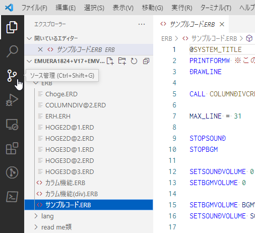  

まだgitリポジトリを作ってない場合はこのように表示されるので、「GitHubに公開」を選ぶ  
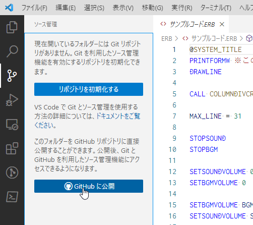  

確認されるので許可する。ブラウザ上でログインしてVSCodeの認証をする  
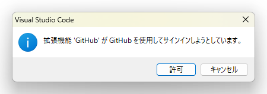  

これでバリアントのファイルを選んでgitリポジトリにプッシュすることになるが、一旦待ってほしい。「`.gitignore`」という、プッシュする際に無視するファイルを設定するとより便利になる  
セーブデータやエラーログファイル、debugフォルダなど、配布時に消すべきものや、共有すると何かと不都合なものは`.gitignore`で設定しておこう  

`.gitignore`

というファイルを作成し、VSCodeやテキストエディタで編集する  
バリアントによって除外するファイルは違うものの、基本は以下のようになる  

- _default.configや_fixed.configを使う場合は必要に応じて除外  
`emuera.config`  

- 画像はプレイヤー側で用意してねというスタンスの場合  
`resources/`  

- ただしCSVファイルでスプライトを指定している場合  
`!resources/*.csv`  

- 以下は除外したほうがいいもの  
`*.sav`  
`*.log`  
`*.lnk`  
`sav/`  
`debug/`  
`macro.txt`  

そしてリポジトリ名を入力し、プッシュするファイルを選択すれば
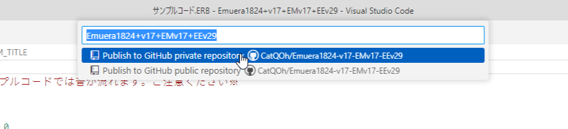  

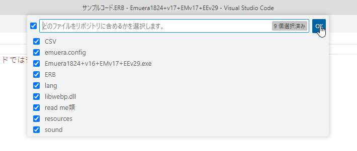  

これでGitHub上にリポジトリが作成される
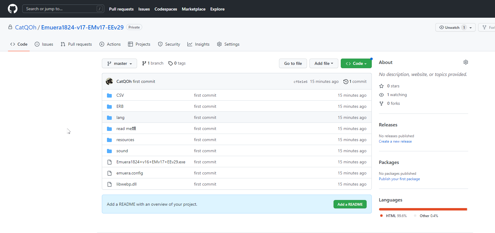  

では次に、このリポジトリに変更をプッシュする方法を説明する。ここまで出来たのなら難しくはない  
今まで通り普通にソースコードを編集し、ある程度まとまったら更新点をコミットする。たとえばバグの修正や機能追加など、アプローチごとに区切ってコミットすると分かりやすいが、ここは各自のやり方次第なので明確な答えは無い  
ただしバリアント作者が「こういう風にコミットしてね」と指示している場合は従うのが無難だ  

リポジトリ作成時と同じくgit機能を開くと、前回のコミットからの変更ファイルが一覧で表示される。ファイルを選択すれば変更箇所も表示される  
この変更に名前を付けてコミットする  
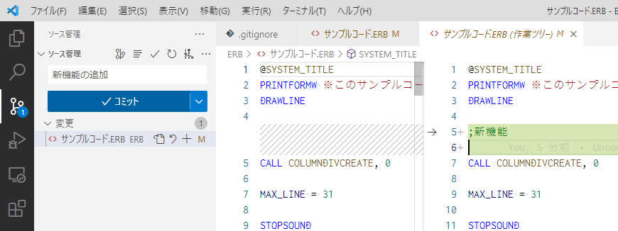  

そして変更の同期を選べばGitHub上のリポジトリに変更がプッシュされる  
これが管理者としての基本的な一連の流れだ  
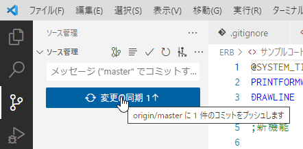  

次項で説明するコントリビューターの操作を受け入れる場合、Settingsの一番下にあるChange Visibilityでパブリック(公開)リポジトリに設定する  
厳重に確認されるのでリスクを踏まえた上でパブリックにしよう  
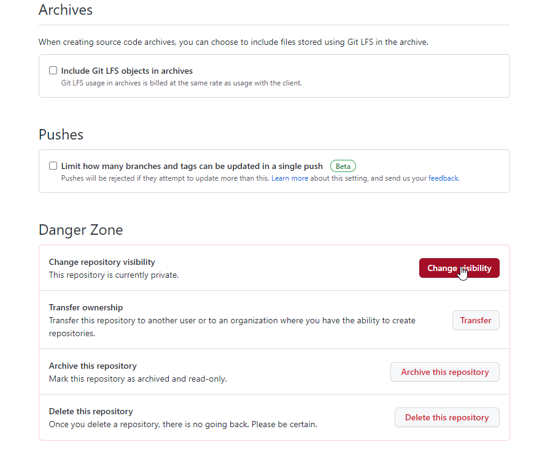  

##  コントリビューター(パッチ作者)のgit操作
管理者のgit操作は説明したが、コントリビューターの場合はどうだろうか  
大本のgitリポジトリに直接アクセスする権限は無いので、プルリクエスト(マージリクエストとも呼ばれる)という形でプッシュが必要になる  
以下、プルリクエストを用いたプッシュを説明するが、管理者が信頼できる製作者なら、リポジトリにアクセスする権限を与えることで管理者と同じ手順でのプッシュができる  
権限を細かく設定することもできるが、リポジトリに何かあっても自己責任でお願いします  

コントリビューターも同じくGitHubでアカウントを作成し、パッチを作りたいバリアントのリポジトリにアクセスして、右上のForkを選ぶ
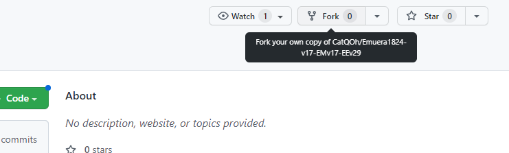  

確認画面が出るので従って進む
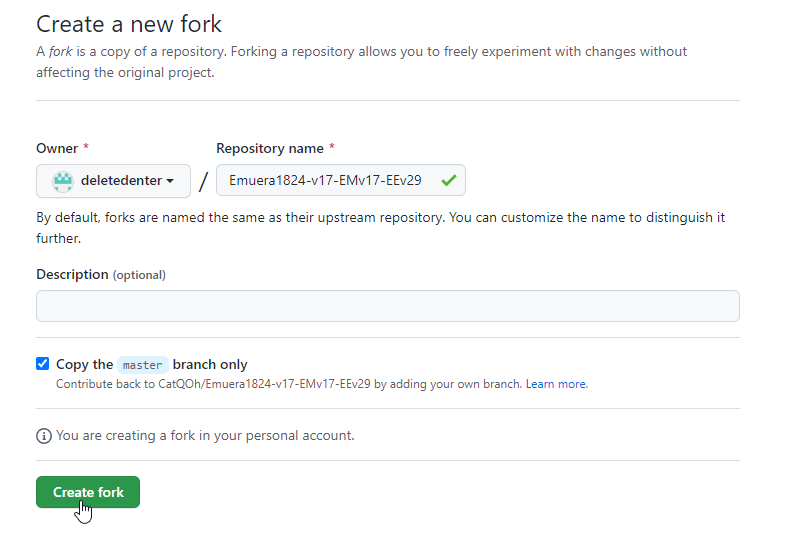  

少し待つと自分のアカウントで、フォーク元と全く同じリポジトリが作成される
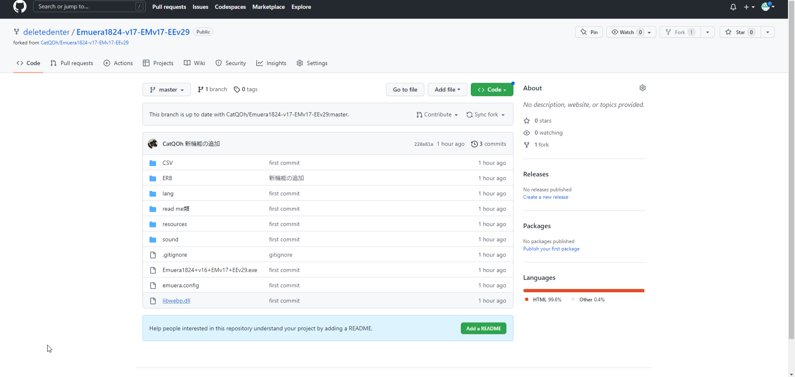  

VSCodeを開き、gitメニューからリポジトリのクローンを選択し、管理者と同じようにGitHubへのログイン認証を進めていく  
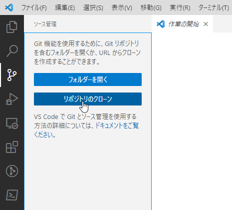  

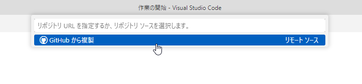  

目的のリポジトリを選択し、それをPC上のどこに保存するかを選ぶと、ソースコードがダウンロードされて編集可能になる
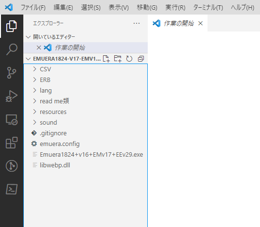  

コミット～プッシュの方法は管理者がやるのと同じだが、フォークしたリポジトリにプッシュされるため本家のリポジトリには反映されない
これを反映させるためにプルリクエストを行う  
  
これはプルリクテスト用のリポジトリ。コミットした内容をブラウザ上から本家にプルリクエストで送ることができる  
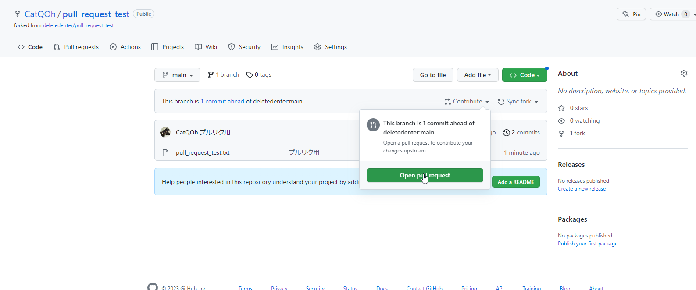  

どういった変更をしたのか管理者に分かるように説明を入れて、プルリクエストを作成する
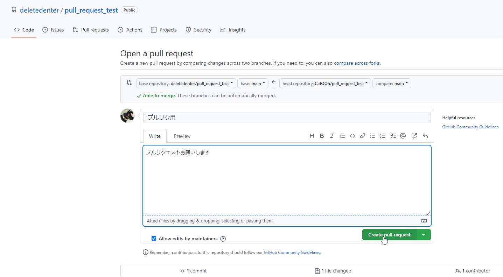  

管理者側にプルリクエストが行ってるので、管理者側でこれを承認することでマージ完了となる。「プルリク送ったよ」などと通達するとよい
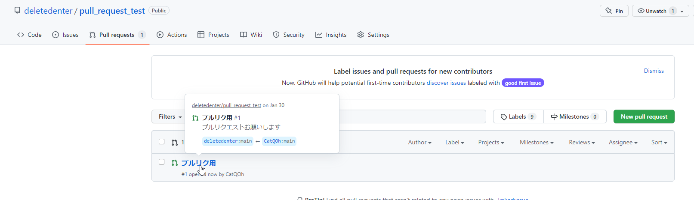  

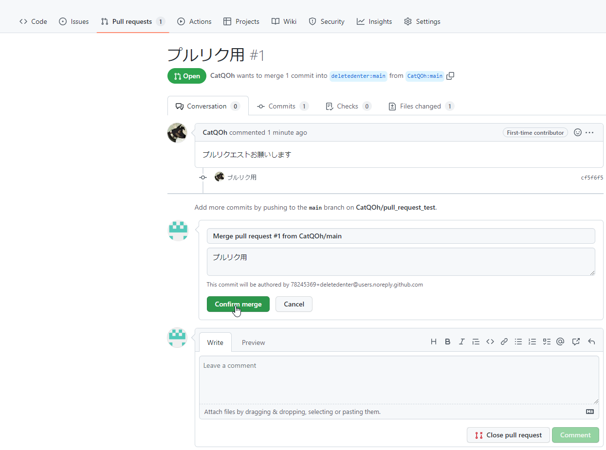  

管理者はプルリクを受け付けてマージすることもあり、リポジトリは常に最新の内容になっているが、コントリビューターの場合はそうとは限らない  
本家のリポジトリから随時更新内容をプルしなくちゃならない  
git操作でもできるが少し難しくなるので、GitHubで用意されているSync fork機能を使うとよい  
これでリポジトリは本家と同期されるので、VSCodeでプルすることで最新のコードの状態になる  
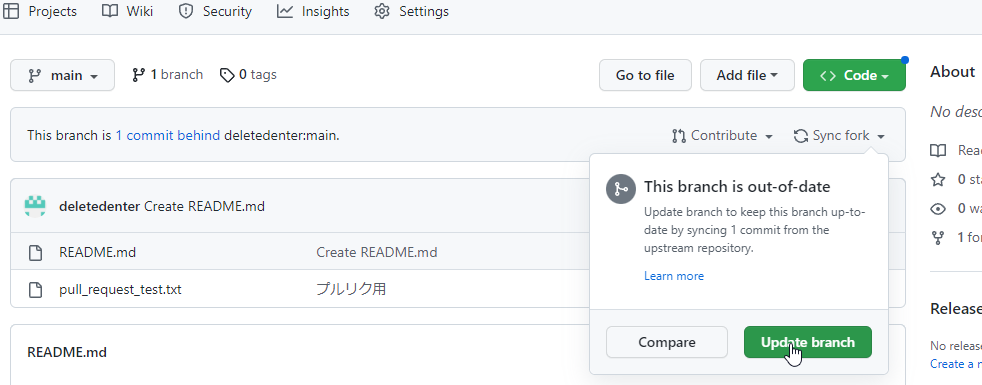  
  
パッチを作ってプルリクを出す時などは競合や古い仕様との衝突を避けるために最新版を確認しておこう
